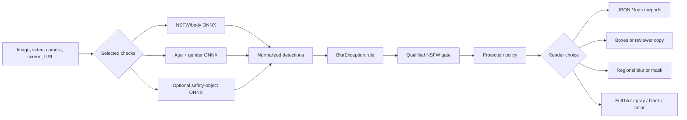
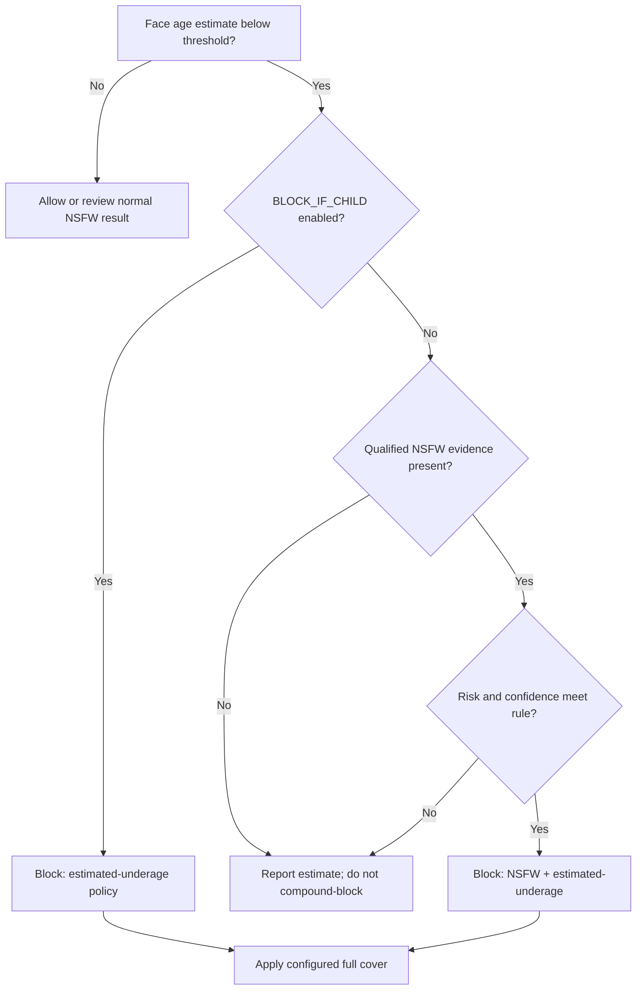
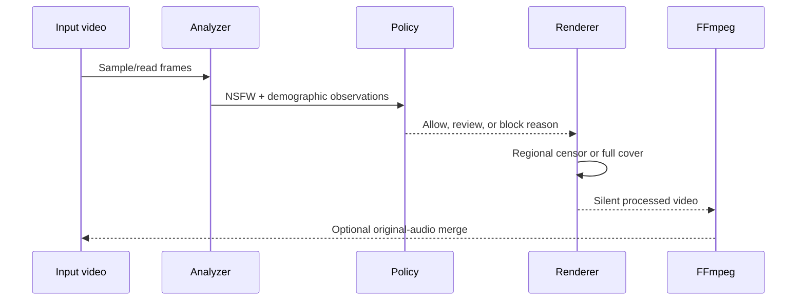
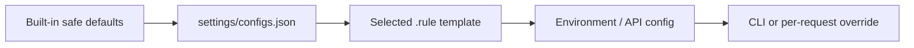

<a id="top"></a>

<div align="center">
  <a href="https://github.com/im-syn/SafeVision">
    
  </a>

  <h1>SafeVision</h1>

  <p><strong>Local-first visual safety for images, video, cameras, screens, streams, and web APIs.</strong></p>
  <p>Run NSFW detection, estimated-age review, model-reported gender classification, policy evaluation, and privacy-safe rendering from one ONNX-powered toolkit.</p>

  <p>
    <a href="https://www.python.org/"></a>
    <a href="https://onnxruntime.ai/"></a>
    <a href="LICENSE"></a>
    <a href="Models/README.md"></a>
    
  </p>

  <p>
    
    
    
    
    
    <a href="https://github.com/im-syn/SafeVision/issues"></a>
    <a href="https://github.com/im-syn/SafeVision/stargazers"></a>
    <a href="https://github.com/im-syn/SafeVision/network/members"></a>
  </p>

  <p>
    <a href="#quick-start">Quick start</a> ·
    <a href="#choose-your-interface">Choose an interface</a> ·
    <a href="#image-processing">Images</a> ·
    <a href="#video-processing">Videos</a> ·
    <a href="#desktop-gui">GUI</a> ·
    <a href="#web-api">Web API</a> ·
    <a href="#rule-templates">Rules</a> ·
    <a href="docs/README.md">Docs</a> ·
    <a href="#troubleshooting">Help</a>
  </p>
</div>

---

> [!TIP]
> **New here?** Start with `python safeVisionCLI.py status`, then process one
> image with the balanced preset. The default workflow runs NSFW, estimated
> age, and model-reported gender together while keeping common armpit/body
> context from causing a compound child-protection block.

> [!NOTE]
> **Hosted API:** [Open the SafeVision RapidAPI playground](https://rapidapi.com/isynx/api/safevision/playground/apiendpoint_aa3ac8f2-2f16-4797-b1d6-ae13c889de15).
> Hosted limits, availability, and policies may differ from a local SafeVision
> deployment.

<table>
  <tr>
    <td width="25%" valign="top">
      <h3>🧠 Three checks</h3>
      <p>NSFW regions, estimated age, and model-reported binary gender can run together or independently.</p>
    </td>
    <td width="25%" valign="top">
      <h3>🛡️ Policy-aware</h3>
      <p>Compound rules separate ordinary body context from qualified NSFW evidence before blocking.</p>
    </td>
    <td width="25%" valign="top">
      <h3>🎭 Private output</h3>
      <p>Choose regional blur, masks, strong full blur, or opaque gray, black, and custom-color covers.</p>
    </td>
    <td width="25%" valign="top">
      <h3>🔌 Many surfaces</h3>
      <p>CLI, desktop GUI, live camera, Screen Guard, OBS streamer, CI, local API, and hosted API.</p>
    </td>
  </tr>
</table>

> [!IMPORTANT]
> **Estimated age is not legal age verification.** The age model returns an
> estimate and no age-confidence value, and it can be less accurate for
> children. Use human review for consequential decisions. The gender field is
> the model's binary visual classification and may not represent a person's
> identity.

<a id="contents"></a>

## 🧭 Explore the project

<table>
  <tr>
    <td width="50%" valign="top">
      <h3>🚀 Start and operate</h3>
      <ul>
        <li><a href="#whats-new">What changed</a></li>
        <li><a href="#architecture">How SafeVision works</a></li>
        <li><a href="#project-map">Project map</a></li>
        <li><a href="#quick-start">Installation and first run</a></li>
        <li><a href="#choose-your-interface">Interface chooser</a></li>
        <li><a href="#detector-selection">Detector selection</a></li>
      </ul>
    </td>
    <td width="50%" valign="top">
      <h3>🛠️ Process and integrate</h3>
      <ul>
        <li><a href="#image-processing">Image processing</a></li>
        <li><a href="#video-processing">Video processing</a></li>
        <li><a href="#desktop-gui">Desktop GUI</a></li>
        <li><a href="#live-tools">Camera, Screen Guard, and OBS</a></li>
        <li><a href="#web-api">REST API and deployment</a></li>
        <li><a href="#configuration">Settings, outputs, and performance</a></li>
      </ul>
    </td>
  </tr>
  <tr>
    <td width="50%" valign="top">
      <h3>🛡️ Policies and privacy</h3>
      <ul>
        <li><a href="#child-protection">Child-protection policy</a></li>
        <li><a href="#rule-templates">50 ready-made rule templates</a></li>
        <li><a href="#full-cover-reference">Full-cover modes and messages</a></li>
        <li><a href="#output-privacy">Boxes, copies, and safe outputs</a></li>
        <li><a href="#responsible-use">Responsible-use boundaries</a></li>
      </ul>
    </td>
    <td width="50%" valign="top">
      <h3>📚 Learn and contribute</h3>
      <ul>
        <li><a href="#command-cookbook">Command cookbook</a></li>
        <li><a href="#demos">Demos</a></li>
        <li><a href="#troubleshooting">Troubleshooting</a></li>
        <li><a href="#testing">Testing</a></li>
        <li><a href="#contributing">Contributing</a></li>
        <li><a href="#support">Maintainer and support</a></li>
      </ul>
    </td>
  </tr>
</table>

<a id="whats-new"></a>

## ✨ What changed from the older SafeVision release

The older public version centered on NSFW boxes and blur. This update keeps
those commands but adds the pieces needed for a child-aware moderation
workflow:

- `nude,age,gender` is now the default check set. Each check can still be
  enabled or disabled independently.
- the ready-made ONNX age/gender model replaces the old unused
  `best_gender.onnx` path;
- a qualified NSFW gate prevents ordinary exposed-armpit/body-context
  detections from turning a safe family photo into an underage + NSFW block;
- image and video policy blocks can use strong blur, solid gray, solid black,
  or a custom solid color, with reason-specific centered text;
- box display, the separate unredacted boxes copy, and the clean blur copy are
  independently controlled;
- `main.py`, `video.py`, `safeVisionCLI.py`, the local API, and the `vision2`
  admin/API use the same policy names;
- the local HTTP service is organized under `SafeVision Web API/`, while
  `python safevision_api.py` remains a compatibility command;
- the large desktop and real-time implementations are organized under `apps/`,
  while the familiar root GUI/live commands remain compatibility launchers;
- 50 complete `.rule` presets and a catalog are included under
  `rule_templates/`;
- every functional/runtime folder now includes a purpose-specific README, with
  dedicated architecture and licensing guides under `docs/`;
- generated media, runtime folders, converted models, local `.env` files, and
  the large age/gender model are kept out of normal Git commits.

See [CHANGELOG.md](CHANGELOG.md) for the file-level migration notes.

<details>
<summary><strong>🔎 Open the old-to-new migration snapshot</strong></summary>

| Area | Older workflow | Current workflow |
|---|---|---|
| Default checks | NSFW/body labels | NSFW + estimated age + model-reported gender |
| Child-aware decisions | No compound policy | Qualified NSFW evidence + estimated-underage policy |
| Common body context | Could contribute to broad censoring | Balanced rules exclude exposed armpits from censoring and compound blocking |
| Whole-media output | Full blur | Strong blur, opaque gray, black, or custom color |
| Output copies | Detection and blur copies were coupled | Final boxes, reviewer copy, and clean censor copy are independent |
| Rules | One active exception file | Active profiles plus 50 documented templates |
| Local API | Root-level application file | Deployable `SafeVision Web API/` with `.env`, Waitress, and result downloads |
| Hosted API | NSFW-centered configuration | Independent NSFW/age/gender checks and admin-controlled protection rendering |

</details>

<p align="right"><a href="#top">⬆️ Back to top</a></p>

<a id="architecture"></a>

## 🏗️ How SafeVision works

SafeVision keeps detection, policy, and rendering separate. This matters:
detection describes what the models observed, policy decides what that means
for the selected workflow, and rendering decides what a viewer is allowed to
see.



### 🧩 The decision path



> [!NOTE]
> A `CHILD` observation is informational under the balanced defaults. It does
> not become a compound block unless qualified NSFW evidence also meets the
> configured risk and confidence gate. Set `BLOCK_IF_CHILD=true` only for a
> workflow that intentionally blocks every estimated-underage result.

### ⚙️ Processing stages

| Stage | Owner | What it does | What it does **not** do |
|---|---|---|---|
| Detection | ONNX models | Produces boxes, labels, scores, age estimates, and gender probability | Decide legality or identity |
| Normalization | Shared Python utilities | Converts every result into common detection and demographic records | Hide the input |
| Rule evaluation | `.rule` file + overrides | Enables labels, thresholds, policy gates, cover text, and cover mode | Load a disabled model |
| Rendering | Image/video/API renderer | Draws boxes, censors regions, or replaces the complete frame | Change the underlying model result |
| Reporting | Logs, JSON, CSV, EDL, FCPXML | Records evidence, decisions, timestamps, and outputs | Count unique people across video frames |

<p align="right"><a href="#top">⬆️ Back to top</a></p>

<a id="project-map"></a>

## 🗂️ Project map

```text
SafeVision/
├── main.py                         Image detection and rendering CLI
├── video.py                        Video analysis, censoring, reports, and audio workflow
├── safeVisionCLI.py                Interactive console and command wrapper
├── SafeVisionGUI.py                Stable desktop compatibility launcher
├── live.py                         Stable camera compatibility launcher
├── safeVisionScreenGuard.py        Stable Screen Guard compatibility launcher
├── live_streamer.py                Stable streamer compatibility launcher
│
├── apps/
│   ├── README.md                   Application map and compatibility contract
│   ├── desktop/
│   │   ├── SafeVisionGUI.py        Maintained PyQt5 desktop implementation
│   │   └── README.md               Complete GUI manual
│   └── live/
│       ├── live.py                 Maintained live-camera implementation
│       ├── safeVisionScreenGuard.py
│       ├── live_streamer.py        OBS and virtual-camera implementation
│       └── README.md               Complete real-time tools manual
│
├── age_gender_detector.py          Batched face age/gender ONNX adapter
├── object_detector.py              Optional smoking/alcohol/drug object adapter
├── safevision_utils.py             Shared providers, rules, risk gate, and rendering helpers
├── marker_export.py                JSON/CSV/EDL/FCPXML reporting helpers
│
├── BlurException.rule              Active label, child-policy, and full-cover rules
├── rule_templates/
│   ├── 01_balanced_default.rule    Recommended starting point
│   ├── ...                         48 additional workflow presets
│   ├── 50_custom_brand_cover.rule  Custom-color example
│   └── README.md                   Complete template catalog
│
├── Models/
│   ├── best.onnx                   NSFW/body-region detector
│   ├── onnx-community...onnx       Local age/gender model; ignored by Git
│   ├── safety_objects.onnx         Optional safety-object detector
│   ├── safety_objects.labels.json  Safety-object class metadata
│   └── README.md                   Provenance, license, metadata, and hashes
│
├── SafeVision Web API/
│   ├── app.py                      Flask API and media renderers
│   ├── web_config.py               Environment-backed settings
│   ├── .env.example                Deployment template
│   ├── wsgi.py                     WSGI entry point
│   ├── start.ps1                   Waitress launcher
│   ├── requirements.txt            Web-only installation set
│   ├── README.md                   Endpoint and deployment manual
│   └── runtime/README.md           Ignored-data boundary and operations
│
├── settings/
│   ├── configs.json                Persistent console settings and profiles
│   └── README.md                   Schema and precedence guide
├── tests/
│   ├── test_age_gender_detector.py Focused synthetic regressions
│   └── README.md                   Test and release guide
├── docs/
│   ├── README.md                   Documentation center
│   ├── PROJECT_STRUCTURE.md        Architecture and ownership map
│   └── LICENSING.md                Code/model/commercial-use boundaries
├── input/, output/, Blur/          Runtime folders with privacy READMEs
├── Prosses/, Logs/                 Restricted reviewer/evidence folders
├── CHILD_PROTECTION.md              Model and policy contract
├── CHANGELOG.md                     Migration details
├── LICENSE                          Exact SafeVision source terms
├── NOTICE                           Attribution and model notices
└── README.md                        You are here
```

<details>
<summary><strong>📦 Runtime and generated folders</strong></summary>

| Folder | Purpose | Safe to publish? | Git behavior |
|---|---|---:|---|
| `input/` | Optional local source media | Usually no | Contents ignored |
| `output/` | Requested final image result | Depends on policy | Contents ignored |
| `Blur/` | Separate clean censored image | Usually safer | Contents ignored |
| `Prosses/` | Unredacted boxes/reviewer copy | **No** | Contents ignored |
| `Logs/` | Text logs and analysis JSON | Review first | Contents ignored |
| `video_output/` | Video results, reports, markers | Depends on result | Contents ignored |
| `SafeVision Web API/runtime/` | API uploads, results, temporary downloads | **No** | Contents ignored |

</details>

> [!NOTE]
> The root GUI/live filenames are intentionally retained as small launchers, so
> existing tutorials and automation keep working. New application development
> belongs in [`apps/`](apps/README.md).

<a id="choose-your-interface"></a>

## 🎛️ Choose your interface

| You want to… | Best entry point | Start command | Typical output |
|---|---|---|---|
| Process one image | `main.py` | `python main.py -i photo.jpg -b --no-boxes` | Image + analysis JSON |
| Process or analyze video | `video.py` | `python video.py -i clip.mp4 --save-report` | Video + JSON/CSV |
| Use one friendly console | `safeVisionCLI.py` | `python safeVisionCLI.py` | Guided CLI workflow |
| Work visually | `SafeVisionGUI.py` | `python SafeVisionGUI.py` | Previewed image/video output |
| Inspect a webcam | `live.py` | `python live.py -c 0 --demographics` | Live local preview |
| Protect a desktop monitor | `safeVisionScreenGuard.py` | `python safeVisionScreenGuard.py --list-monitors` | Overlay/block/blur |
| Feed OBS or a virtual camera | `live_streamer.py` | `python live_streamer.py -i camera` | Stream/scene actions |
| Integrate over HTTP | `safevision_api.py` | `python safevision_api.py` | JSON + downloadable result |
| Add an upload gate to CI | `main.py` | `python main.py -i photo.jpg --fail-on-policy` | Exit code + JSON evidence |

Detailed interface manuals:

- [Desktop GUI](apps/desktop/README.md)
- [Live camera, Screen Guard, and OBS](apps/live/README.md)
- [Local Web API](SafeVision%20Web%20API/README.md)
- [Application package and compatibility](apps/README.md)
- [Complete documentation center](docs/README.md)

### 🧰 Capability matrix

| Surface | NSFW | Age | Gender | Objects | Regional censor | Full cover | Reports | Audio |
|---|:---:|:---:|:---:|:---:|:---:|:---:|:---:|:---:|
| Image CLI | ✅ | ✅ | ✅ | ✅ | ✅ | ✅ | JSON/log | — |
| Video CLI | ✅ | ✅ | ✅ | ✅ | ✅ | ✅ | JSON/CSV/markers | ✅ FFmpeg |
| Desktop GUI | ✅ | ✅ | ✅ | ✅ | ✅ | ✅ | ✅ | ✅ FFmpeg |
| Live camera | ✅ | ✅ | ✅ | Optional | ✅ | Policy block | Runtime | Live |
| Screen Guard | ✅ | ✅ | ✅ | Optional | ✅ | Policy block | Runtime | — |
| Live Streamer | ✅ | ✅ | ✅ | Optional | ✅ | Policy block | Runtime | Stream |
| Local Web API | ✅ | ✅ | ✅ | Configurable | ✅ | ✅ | JSON | No¹ |
| `vision2` API/admin | ✅ | ✅ | ✅ | Existing service config | ✅ | ✅ | JSON/admin | Configurable |

<sub>¹ The local OpenCV API renderer does not preserve video audio. Use `video.py --with-audio` or an FFmpeg post-processing step.</sub>

<p align="right"><a href="#top">⬆️ Back to top</a></p>

<a id="quick-start"></a>

## 🚀 Quick start

<p>
  
  
  
  
  
</p>

Clone the repository and enter the project:

```powershell
git clone https://github.com/im-syn/SafeVision.git
Set-Location .\SafeVision
```

### <kbd>1</kbd> Install Python dependencies

Python 3.10 or newer is recommended. From the SafeVision directory:

```powershell
python -m venv .venv
Set-ExecutionPolicy -Scope Process Bypass
.\.venv\Scripts\Activate.ps1
python -m pip install --upgrade pip
python -m pip install -r requirements.txt
```

On Linux or macOS, activate the environment with:

```bash
source .venv/bin/activate
```

FFmpeg is recommended for video audio preservation, transcoding, and broader
codec support. Basic image analysis does not require it.

<details>
<summary><strong>🐧 Linux / macOS installation commands</strong></summary>

```bash
git clone https://github.com/im-syn/SafeVision.git
cd SafeVision
python3 -m venv .venv
source .venv/bin/activate
python -m pip install --upgrade pip
python -m pip install -r requirements.txt
```

Screen Guard contains Windows-specific capture support; image, video, API,
camera, and compatible live-stream features use cross-platform Python/OpenCV
paths.

</details>

<details>
<summary><strong>⚡ Optional GPU provider setup</strong></summary>

Install only one ONNX Runtime package that matches the machine and drivers.
Examples:

```powershell
# NVIDIA CUDA build
python -m pip uninstall -y onnxruntime
python -m pip install onnxruntime-gpu

# Return to the portable CPU build
python -m pip uninstall -y onnxruntime-gpu
python -m pip install "onnxruntime>=1.18,<2"
```

Then inspect what SafeVision can actually use:

```powershell
python safeVisionCLI.py providers
```

</details>

### <kbd>2</kbd> Check the model files

SafeVision uses these model files:

- `Models/best.onnx` — NSFW/body-region detector. The image/video tools try to
  download it automatically if it is missing.
- `Models/onnx-communityage-gender-prediction-ONNX.onnx` — estimated age and
  gender model. Download `onnx/model.onnx` from
  [onnx-community/age-gender-prediction-ONNX](https://huggingface.co/onnx-community/age-gender-prediction-ONNX/tree/main/onnx)
  and rename/place it at this exact path.
- `Models/safety_objects.onnx` and `Models/safety_objects.labels.json` —
  optional safety-object detector and metadata.

The age/gender model needs ONNX Runtime 1.18 or newer. The requirement is
already enforced by `requirements.txt`.

PowerShell download command:

```powershell
Invoke-WebRequest `
  -Uri "https://huggingface.co/onnx-community/age-gender-prediction-ONNX/resolve/main/onnx/model.onnx" `
  -OutFile ".\Models\onnx-communityage-gender-prediction-ONNX.onnx"
```

The age/gender file is intentionally ignored by Git because it is too large
for an ordinary repository commit. Keep it in the local `Models/` folder, use
Git LFS, or attach it to your own release/deployment artifact.

### <kbd>3</kbd> Verify the installation

```powershell
python safeVisionCLI.py init
python safeVisionCLI.py status
python safeVisionCLI.py providers
```

A healthy status should show `Models/best.onnx`, the age/gender model, the
active rule file, writable runtime directories, and at least the CPU execution
provider.

### <kbd>4</kbd> Process the first image

```powershell
python main.py `
  -i ".\input\photo.jpg" `
  -o ".\output\photo_checked.jpg" `
  -b
```

This runs NSFW, age, and gender checks. `-b` applies regional blur to labels
allowed by `BlurException.rule`. If the child-protection compound rule is
matched, the protected output is fully obscured.

### <kbd>5</kbd> Inspect the result

```powershell
Get-Item ".\output\photo_checked.jpg"
Get-Content ".\Logs\photo_checked.jpg.analysis.json"
```

The image shows the requested rendering. The analysis JSON keeps the detector
selection, demographic observations, qualified NSFW evidence, policy verdict,
and exact output choices separate for auditing.

> [!TIP]
> Prefer `-b --no-boxes --no-save-boxes-copy` for a public-facing censored
> image. Enable the `Prosses/` reviewer copy only when an authorized reviewer
> needs the original detections.

<p align="right"><a href="#top">⬆️ Back to top</a></p>

<a id="detector-selection"></a>

## 🧠 Detector selection

Use `--detectors` with any comma-separated combination:

- `nude` or `nsfw` — NSFW/body-region detector only;
- `age` — estimated age and underage status only;
- `gender` — model-reported gender only;
- `demographics` — age and gender;
- `protection` — NSFW, age, and gender;
- `objects` — optional safety-object model only;
- `both` — NSFW and safety objects; this legacy alias does not include age;
- `all` — NSFW, safety objects, age, and gender;
- `none` — disable all detectors where supported.

If `--detectors` is omitted, SafeVision uses `nude,age,gender`.

Examples:

```powershell
# Balanced default
python main.py -i ".\input\photo.jpg"

# Underage estimation only
python main.py -i ".\input\photo.jpg" --detectors age

# Age and gender, without NSFW detection
python main.py -i ".\input\photo.jpg" --detectors demographics

# Everything, including the optional safety-object model
python main.py -i ".\input\photo.jpg" --detectors all
```

<details>
<summary><strong>🧪 Detector aliases and when to use them</strong></summary>

| Value | Expands to | Good for |
|---|---|---|
| `nude` / `nsfw` | NSFW/body detector | Existing NSFW-only integrations |
| `age` | Age estimate only | Review pipelines that do not need gender output |
| `gender` | Gender probability only | Model-output analysis; not identity inference |
| `demographics` | Age + gender | Face-level metadata without NSFW inference |
| `protection` | NSFW + age + gender | Balanced child-aware moderation |
| `objects` | Safety-object model | Smoking, alcohol, and configured drug objects |
| `both` | NSFW + objects | Legacy two-content-model workflow |
| `all` | NSFW + objects + age + gender | Maximum available coverage |
| `none` | No model inference | Fast forced-cover rendering |

</details>

<p align="right"><a href="#top">⬆️ Back to top</a></p>

<a id="image-processing"></a>

## 🖼️ Images with `main.py`

There are three separate output controls:

| Control | Result |
|---|---|
| `--boxes` / `--no-boxes` | Shows or hides boxes on the final image. Boxes do not censor anything. |
| `-b` / `--blur` | Applies regional censoring according to the selected `.rule` file. |
| `--force-full-cover` or an automatic policy/count trigger | Replaces the final image with a whole-image cover and centered reason. |

The normal image command keeps boxes enabled for compatibility. The separate
unredacted `Prosses/` boxes copy is disabled by default because it may expose
the content that the safe output was meant to hide.

### 🟩 Boxes only

```powershell
python main.py `
  -i ".\input\photo.jpg" `
  -o ".\output\photo_boxes.jpg" `
  --boxes `
  --no-save-boxes-copy
```

To save a second reviewer/debug copy in `Prosses/`, add
`--save-boxes-copy`. Do not publish that file as a censored result.

### 🟦 Regional blur with no boxes

```powershell
python main.py `
  -i ".\input\photo.jpg" `
  -o ".\output\photo_blurred.jpg" `
  -b --no-boxes `
  --detectors nude,age,gender
```

By default this also writes a clean regional-censor copy under `Blur/`. Use
`--no-save-blur-copy` when only the requested `-o` file should be written.

### ⬛ Regional solid masks

`--color` affects detected regions, not the whole image. Colors use OpenCV BGR
order:

```powershell
python main.py `
  -i ".\input\photo.jpg" `
  -o ".\output\photo_masked.jpg" `
  -b --no-boxes --color `
  --mask-color "0,0,0" `
  --mask-shape ellipse
```

<a id="full-cover-reference"></a>

### 🛑 Full-cover modes

The whole-image cover has four modes:

- `blur` — strong two-pass blur. It obscures detail but retains broad colors
  and silhouettes.
- `gray` — replaces every source pixel with opaque gray.
- `black` — replaces every source pixel with black.
- `color` — replaces every source pixel with `--full-cover-color`.

Use a solid mode when the source must not be visible at all.

| Mode | What remains visible? | Best use |
|---|---|---|
| `blur` | Broad color and silhouette may remain | Internal review or less destructive concealment |
| `gray` | No source pixels | Neutral blocked preview |
| `black` | No source pixels | Maximum visual suppression |
| `color` | No source pixels | Branded/kiosk-safe replacement |

> [!WARNING]
> A strong blur is still derived from the source. When the underlying media
> must never be visible, select `gray`, `black`, or `color`; these modes create
> a new solid frame before optional text is drawn.

Force a solid gray result for a test:

```powershell
python main.py `
  -i ".\input\photo.jpg" `
  -o ".\output\photo_covered.jpg" `
  --force-full-cover `
  --full-cover-mode gray `
  --no-boxes
```

Force a custom cover with no text:

```powershell
python main.py `
  -i ".\input\photo.jpg" `
  --force-full-cover `
  --full-cover-mode color `
  --full-cover-color "110,64,28" `
  --no-full-cover-text
```

`B,G,R` values are used by the command-line tools. The web APIs also accept
`#RRGGBB`.

`--full-cover-mode` selects how a cover looks; it does not trigger one by
itself. A cover is triggered by one of these conditions:

- `--force-full-cover`;
- `-fbr N` after at least `N` censorable detections;
- a blocking child-protection policy.

Example: cover an image after one censorable NSFW detection and use the
NSFW-only message:

```powershell
python main.py `
  -i ".\input\photo.jpg" `
  -b -fbr 1 `
  --full-cover-mode black
```

The automatic centered messages are:

- NSFW-only trigger: `Explicit content hidden`
- qualified NSFW + estimated underage: `Possible illegal content - review required`
- underage-only policy: `Estimated underage person - review required`
- near-threshold age review: `Age review required`

They are policy descriptions, not legal findings. Override the text for one
run with `--full-cover-message "Your text"`, or edit the
`FULL_COVER_MESSAGE_*` values in the selected rule file.

<a id="rule-templates"></a>

### 🧰 Select a ready-made rule file

```powershell
python main.py `
  -i ".\input\photo.jpg" `
  -b --no-boxes `
  -e ".\rule_templates\12_compound_child_gray.rule"
```

There are 50 documented presets in
[`rule_templates/README.md`](rule_templates/README.md).

<p>
  
  
  
  
</p>

Recommended starting points:

| Template | Choose it when… |
|---|---|
| `01_balanced_default.rule` | You want the safest general starting point |
| `12_compound_child_gray.rule` | Qualified NSFW + estimated-underage should produce an opaque gray result |
| `21_explicit_regions_only.rule` | Only HIGH/CRITICAL explicit regions should be censored |
| `33_family_photo_low_false_positive.rule` | Ordinary family/body context should be especially resistant to false positives |
| `42_ci_compound_block.rule` | A CI job should fail on the balanced compound policy |
| `48_solid_gray_no_text.rule` | The blocked result must reveal no source pixels and show no text |

### 🎚️ Custom age and policy overrides

```powershell
python main.py `
  -i ".\input\photo.jpg" `
  --underage-age 18 `
  --age-review-margin 3 `
  --block-if-nsfw-and-child `
  --no-block-if-child `
  --child-nsfw-min-risk HIGH `
  --child-nsfw-min-confidence 0.5
```

### 🤖 CI exit behavior

```powershell
# Exit 2 when the configured protection policy blocks the image
python main.py -i ".\input\photo.jpg" --fail-on-policy

# Exit 3 whenever any face is estimated below the age threshold
python main.py -i ".\input\photo.jpg" --fail-on-underage

# PowerShell: inspect the result
$LASTEXITCODE
```

`--fail-on-underage` is intentionally stricter than the balanced protection
policy. It can fail on a safe family photo because it tests the estimated age
result without requiring qualified NSFW evidence.

<p align="right"><a href="#top">⬆️ Back to top</a></p>

<a id="video-processing"></a>

## 🎬 Videos with `video.py`

Video processing separates analysis from rendering. The detector pass builds
frame statistics and evidence; the renderer then creates the requested
regional output or an automatic whole-video cover.



### 🎞️ Regional-censor output without boxes

```powershell
python video.py `
  -i ".\input\video.mp4" `
  -vo ".\video_output" `
  --no-boxes --with-audio `
  --detectors nude,age,gender `
  --save-report `
  --report-formats json,csv
```

The regular video path censors configured regions and writes
`video_output/<name>_processed.mp4`. `--with-audio` uses FFmpeg to add the
source audio when available.

### 🔍 Reviewer copy with boxes

```powershell
python video.py `
  -i ".\input\video.mp4" `
  -vo ".\video_output" `
  --boxes --blur --with-audio `
  --detectors nude,age,gender
```

`--boxes` switches to the annotated-video workflow. Add `--blur` to censor
matching regions in that annotated copy. A boxes-only video remains
unredacted and should be restricted to reviewers.

### 🚨 Automatic full-video cover

The monitor rule `-r percentage/count` creates a second fully covered video
when either threshold is met. `-fbr labels/frames` adds a per-frame density
rule.

```powershell
python video.py `
  -i ".\input\video.mp4" `
  -vo ".\video_output" `
  -e ".\rule_templates\12_compound_child_gray.rule" `
  --detectors nude,age,gender `
  -r 10/5 `
  -fbr 2/10 `
  --full-cover-mode gray `
  --with-audio `
  --save-report
```

This means: create the full-cover version when NSFW appears in at least 10%
of frames, in at least 5 frames, when two censorable labels occur in at least
10 frames, or when the selected child-protection policy blocks a frame.

The generated filename ends in `_fully_covered.mp4`. The policy-specific text
is centered on every frame. For a qualified NSFW + estimated-underage match,
the default is `Possible illegal content - review required`.

### ⬛ Force a complete black video

```powershell
python video.py `
  -i ".\input\video.mp4" `
  -vo ".\video_output" `
  --detectors none `
  --force-full-cover `
  --full-cover-mode black `
  --full-cover-message "Unavailable under this content policy" `
  --with-audio
```

`gray`, `black`, and `color` write a solid frame, so the input image is not
visible underneath. With `--detectors none`, forced-cover mode skips model
loading and inference and writes only the covered output; it does not leave an
uncensored processed-video copy. Use `--no-full-cover-text` for a plain solid
video.

### 📊 Analyze without rendering a video

```powershell
python video.py `
  -i ".\input\video.mp4" `
  --detectors nude,age,gender `
  --analyze-only `
  --save-report `
  --report-formats json,csv
```

### 👥 Demographics only

```powershell
python video.py `
  -i ".\input\video.mp4" `
  --detectors demographics `
  --analyze-only `
  --save-report
```

### ✂️ Export editing markers

```powershell
python video.py `
  -i ".\input\video.mp4" `
  --analyze-only --save-report `
  --export-markers both `
  --marker-gap 1.0
```

Marker formats are `edl`, `fcpxml`, or `both`. Video demographic totals are
sampled face observations across frames, not counts of unique people.

Useful video switches:

- `--enhanced-blur` — stronger regional blur;
- `--color --mask-color "0,0,0"` — regional solid masks;
- `--mask-shape ellipse` — elliptical regional masks;
- `--save-boxes-copy` — in `-t frames` mode, keep separate unredacted box
  images;
- `--no-boxes` — explicitly disable the annotated-video path;
- `--full-cover-text` / `--no-full-cover-text` — toggle the centered message;
- `-e path.rule` — apply the same policy template used by `main.py`.

<details>
<summary><strong>📁 Video output naming guide</strong></summary>

| Output | Meaning |
|---|---|
| `<name>_processed.mp4` | Regular region-censored result |
| `<name>_processed_with_audio.mp4` | Regular result with source audio merged by FFmpeg |
| `<name>_boxes.mp4` | Detection-box reviewer result |
| `<name>_boxes_with_audio.mp4` | Reviewer result with source audio |
| `<name>_fully_covered.mp4` | Whole-video blur or solid cover |
| `<name>_fully_covered_with_audio.mp4` | Covered result with source audio |
| `<name>_detections.json` / `.csv` | Frame/time detection report |
| `<name>.edl` / `.fcpxml` | Editing markers for supported NLE workflows |

Solid-cover outputs replace every video frame. Boxes-only outputs may expose
the original content and belong in restricted review storage.

</details>

<p align="right"><a href="#top">⬆️ Back to top</a></p>

<a id="command-cookbook"></a>

## 🍳 Copy-and-run command cookbook

These recipes are deliberately explicit about privacy-sensitive defaults.
Replace the example media paths, then paste the command into PowerShell.

<details open>
<summary><strong>🖼️ Public-facing image: balanced censor, no boxes, no reviewer copy</strong></summary>

```powershell
python main.py `
  -i ".\input\photo.jpg" `
  -o ".\output\photo_safe.jpg" `
  --detectors nude,age,gender `
  -e ".\rule_templates\01_balanced_default.rule" `
  -b --no-boxes `
  --no-save-boxes-copy `
  --save-blur-copy
```

</details>

<details>
<summary><strong>🛑 Child-aware image gate with opaque gray policy output</strong></summary>

```powershell
python main.py `
  -i ".\input\upload.jpg" `
  -o ".\output\upload_checked.jpg" `
  --detectors protection `
  -e ".\rule_templates\12_compound_child_gray.rule" `
  -b --no-boxes `
  --fail-on-policy

if ($LASTEXITCODE -eq 2) {
  Write-Host "Blocked by the configured protection policy"
}
```

</details>

<details>
<summary><strong>🎥 Video moderation with audio, report, and editing markers</strong></summary>

```powershell
python video.py `
  -i ".\input\clip.mp4" `
  -vo ".\video_output" `
  --detectors nude,age,gender `
  -e ".\rule_templates\12_compound_child_gray.rule" `
  --no-boxes --with-audio `
  --save-report --report-formats json,csv `
  --export-markers both --marker-gap 1.0
```

</details>

<details>
<summary><strong>⚡ Fast cover-only render without loading a model</strong></summary>

```powershell
# Image
python main.py -i ".\input\photo.jpg" `
  --detectors none --force-full-cover `
  --full-cover-mode gray --no-boxes --no-full-cover-text

# Video
python video.py -i ".\input\clip.mp4" -vo ".\video_output" `
  --detectors none --force-full-cover `
  --full-cover-mode black --no-full-cover-text --with-audio
```

In forced video cover-only mode, SafeVision skips inference and does not write
an uncensored `_processed.mp4` intermediate.

</details>

<details>
<summary><strong>🧪 Age/gender research output without NSFW inference</strong></summary>

```powershell
python main.py `
  -i ".\input\portrait.jpg" `
  --detectors demographics `
  --no-boxes --no-save-boxes-copy --no-save-blur-copy
```

Review the structured face results in `Logs/<output>.analysis.json`. Do not use
the estimates as proof of age, identity, or self-described gender.

</details>

<details>
<summary><strong>🌐 Start and exercise the local API</strong></summary>

```powershell
# Terminal 1: from the project root
Copy-Item ".\SafeVision Web API\.env.example" ".\SafeVision Web API\.env"
Set-Location ".\SafeVision Web API"
.\start.ps1

# Terminal 2: from the project root
curl.exe -X POST `
  -F "file=@.\input\photo.jpg" `
  -F "checks=nude,age,gender" `
  -F "blur=true" `
  -F "boxes=false" `
  -F "full_cover_mode=gray" `
  http://127.0.0.1:5000/api/v1/detect
```

</details>

<a id="all-in-one-console"></a>

## 🧭 All-in-one console

Open the interactive console:

```powershell
python safeVisionCLI.py
```

Useful non-interactive commands:

```powershell
# Initialize folders, settings, and the active rule file
python safeVisionCLI.py init

# Inspect installation, model, folder, provider, and policy status
python safeVisionCLI.py status

# Scan the input directory
python safeVisionCLI.py scan ".\input" --recursive

# Automatically select main.py or video.py by file extension
python safeVisionCLI.py process ".\input\photo.jpg" --blur
python safeVisionCLI.py process ".\input\video.mp4" --boxes --blur --save-report

# Select a preset and a solid policy cover through the wrapper
python safeVisionCLI.py process ".\input\photo.jpg" --blur --no-boxes `
  -e ".\rule_templates\12_compound_child_gray.rule" `
  --full-cover-mode gray

# Force a whole-video black cover
python safeVisionCLI.py process ".\input\video.mp4" `
  --detectors none --force-full-cover --full-cover-mode black --with-audio

# Launch interfaces
python safeVisionCLI.py launch gui
python safeVisionCLI.py launch api
python safeVisionCLI.py launch live
python safeVisionCLI.py launch streamer
```

<p align="right"><a href="#top">⬆️ Back to top</a></p>

<a id="desktop-gui"></a>

## 🖥️ Desktop GUI

```powershell
python SafeVisionGUI.py
```

The GUI exposes image/video selection, output options, detector toggles,
estimated-underage threshold, model paths, blur/mask settings, reports, and
video options. The Basic tab also exposes the compound child-protection rule,
underage-only and review-band blocking, qualified NSFW risk/confidence,
final-box display, reviewer-copy and clean-blur-copy switches, and the complete
full-cover mode/color/text controls. The selected `.rule` preset appears on
the Advanced tab and is passed to both `main.py` and `video.py`.

### 🗺️ GUI control map

| Area | Main controls | Why it matters |
|---|---|---|
| File input | Browse, drag/drop, preview | Confirms the selected image/video before processing |
| Detector Models | Content model, age toggle, gender toggle, underage threshold, review margin | Enables each check independently |
| Child Protection Policy | Compound rule, any-child rule, review-band rule, NSFW risk/confidence | Controls when demographic observations affect the verdict |
| Blur Options | Strength, solid regional mask, color, rectangle/ellipse | Controls detected-region censoring |
| Output Privacy and Full Cover | Final boxes, reviewer copy, clean blur copy, force cover, mode/color/text | Prevents accidental unredacted output |
| Video Options | Audio, codec, frame cleanup | Controls video packaging |
| Analysis / Editor Markers | Analyze-only, reports, EDL/FCPXML | Supports review and editing workflows |
| Advanced | Monitoring thresholds and `.rule` file | Selects automatic cover behavior and templates |

> [!TIP]
> For a public-facing output, turn **final boxes off**, keep **reviewer boxes
> copy off**, enable regional censoring, and choose an opaque full-cover mode
> for policy blocks. The reviewer copy is intentionally labeled as unredacted.

<details>
<summary><strong>⌨️ GUI-equivalent command example</strong></summary>

```powershell
python main.py `
  -i ".\input\photo.jpg" `
  --detectors nude,age,gender `
  --underage-age 18 --age-review-margin 3 `
  --block-if-nsfw-and-child --no-block-if-child `
  --child-nsfw-min-risk HIGH --child-nsfw-min-confidence 0.5 `
  -e ".\rule_templates\01_balanced_default.rule" `
  -b --no-boxes --no-save-boxes-copy `
  --full-cover-mode gray --full-cover-text
```

</details>

<p align="right"><a href="#top">⬆️ Back to top</a></p>

<a id="live-tools"></a>

## 📡 Live tools

Live tools reuse the same detector selection, rule file, risk gate, and
demographic limitations. Choose the entry point based on where the pixels
come from and where the protected output needs to go.

### 📷 Live camera

Age and gender checks are enabled by default:

```powershell
python live.py -c 0 --demographics --underage-age 18
```

Performance-oriented example:

```powershell
python live.py `
  -c 0 `
  --demographics `
  --skip-frames 3 `
  --no-boxes
```

Disable age and gender for NSFW-only camera processing:

```powershell
python live.py -c 0 --no-demographics
```

### 🖥️ Desktop Screen Guard

List available monitors:

```powershell
python safeVisionScreenGuard.py --list-monitors
```

Protect monitor 1:

```powershell
python safeVisionScreenGuard.py `
  --monitor 1 `
  --mode both `
  --detectors nsfw,age,gender `
  --show-status `
  --show-demographics `
  --fps 4
```

To run the saved settings from `settings/configs.json`:

```powershell
python safeVisionCLI.py screen
```

Demographic boxes are informational. They do not censor a face by themselves.
A matched child-protection policy can still activate full-monitor protection.

### 🎙️ Live Streamer and OBS

Camera example:

```powershell
python live_streamer.py `
  -i camera -c 0 `
  --detectors nsfw,age,gender `
  --show-demographics `
  --ai-fps 5
```

Screen example with OBS scene switching:

```powershell
python live_streamer.py `
  -i screen -m 1 `
  --detectors nsfw,age,gender `
  --auto-scene-switch `
  --obs-host localhost `
  --obs-port 4455
```

OBS and virtual-camera features require their corresponding optional runtime
and local application configuration.

<details>
<summary><strong>⚡ Live-performance checklist</strong></summary>

- Start with CPU and a low analysis FPS; increase only after measuring.
- Reuse the default NSFW face boxes for age/gender instead of adding another
  face detector.
- Increase `--skip-frames` or reduce `--ai-fps` when the preview lags.
- Keep the CPU execution provider as a fallback when a GPU provider is used.
- Test overlay capture exclusion before monitoring the same screen that shows
  SafeVision's overlay.
- Use solid policy blocks where even a heavily blurred live frame is too much
  visual disclosure.

</details>

<p align="right"><a href="#top">⬆️ Back to top</a></p>

<a id="child-protection"></a>

## 🛡️ Child-protection rules

Rules live in `BlurException.rule`. The balanced defaults are:

```ini
ARMPITS_EXPOSED = false

BLOCK_IF_NSFW_AND_CHILD = true
BLOCK_IF_CHILD = false
BLOCK_ON_AGE_REVIEW = false
PROTECTION_NSFW_MIN_RISK = HIGH
PROTECTION_NSFW_MIN_CONFIDENCE = 0.5
UNDERAGE_AGE = 18
AGE_REVIEW_MARGIN = 3

FULL_COVER_MODE = blur
FULL_COVER_COLOR = 96,96,96
FULL_COVER_TEXT_COLOR = 255,255,255
FULL_COVER_SHOW_TEXT = true
FULL_COVER_BLUR_STRENGTH = 99
FULL_COVER_MESSAGE_NSFW = Explicit content hidden
FULL_COVER_MESSAGE_NSFW_AND_CHILD = Possible illegal content - review required
FULL_COVER_MESSAGE_CHILD = Estimated underage person - review required
FULL_COVER_MESSAGE_REVIEW = Age review required
```

The default compound decision works like this:

1. A face must be estimated below `UNDERAGE_AGE`.
2. The NSFW detector must also produce a `HIGH` or `CRITICAL` label.
3. That explicit label must meet confidence `0.5`.

### 🧮 Balanced policy examples

| Observation | Estimated underage? | Qualified NSFW gate? | Default result |
|---|:---:|:---:|---|
| Face only | ✅ | ❌ | `ALLOW` or age-band `REVIEW`; no compound block |
| Exposed armpit only | ✅ | ❌ (`LOW`, and region disabled) | `ALLOW`; no compound block |
| Covered body label | ✅ | ❌ (`SAFE`) | `ALLOW`; no compound block |
| High-risk explicit label below confidence | ✅ | ❌ | `ALLOW`/`REVIEW`; evidence remains visible in JSON |
| High/critical explicit label at required confidence | ✅ | ✅ | `BLOCKED`; NSFW + estimated-underage reason |
| Any estimated-underage face with `BLOCK_IF_CHILD=true` | ✅ | Not required | `BLOCKED`; underage-only reason |
| Near-threshold estimate with `BLOCK_ON_AGE_REVIEW=true` | No | Not required | `BLOCKED`; review-band reason |

Risk tiers used by this compound rule:

- `LOW` — exposed armpits, belly, feet, or male chest;
- `MODERATE` — exposed buttocks;
- `HIGH` — exposed female breast or anus;
- `CRITICAL` — exposed genitalia.

Low-risk body-context observations do not turn an ordinary child/family photo
into a full-image block. The `strict` profile restores armpit censoring and
uses `MODERATE` with confidence `0.35`.

Manage profiles from the CLI:

```powershell
python safeVisionCLI.py rules list
python safeVisionCLI.py rules show default
python safeVisionCLI.py rules use strict
python safeVisionCLI.py rules use default

python safeVisionCLI.py rules set default BLOCK_IF_NSFW_AND_CHILD true
python safeVisionCLI.py rules set default PROTECTION_NSFW_MIN_RISK HIGH
python safeVisionCLI.py rules set default PROTECTION_NSFW_MIN_CONFIDENCE 0.5
python safeVisionCLI.py rules set default UNDERAGE_AGE 18
```

Use `BLOCK_IF_CHILD=true` only when the intended policy is to block every
estimated child even when there is no explicit content.

See [CHILD_PROTECTION.md](CHILD_PROTECTION.md) for the full model contract,
policy details, performance notes, and accuracy limitations.

> [!CAUTION]
> The centered phrase `Possible illegal content - review required` is a
> configurable moderation message, not a legal conclusion. SafeVision cannot
> establish identity, actual age, consent, jurisdiction, or legality from an
> image. Preserve an authorized human-review and escalation process.

<p align="right"><a href="#top">⬆️ Back to top</a></p>

<a id="web-api"></a>

## 🌐 REST API

The deployable service now lives in `SafeVision Web API/`. The root launcher
is kept so existing integrations do not break.

Install and configure it:

```powershell
python -m pip install -r ".\SafeVision Web API\requirements.txt"
Copy-Item ".\SafeVision Web API\.env.example" ".\SafeVision Web API\.env"
python safevision_api.py
```

The default address is `http://127.0.0.1:5000`. For a longer-running local or
server process, use Waitress:

```powershell
Set-Location ".\SafeVision Web API"
.\start.ps1
```

<p>
  
  
  
  
</p>

Health check:

```powershell
curl.exe http://localhost:5000/api/v1/health
```

Upload an image with regional blur and no boxes:

```powershell
curl.exe -X POST `
  -F "file=@.\input\photo.jpg" `
  -F "checks=nude,age,gender" `
  -F "blur=true" `
  -F "boxes=false" `
  http://localhost:5000/api/v1/detect
```

Force a solid gray full cover:

```powershell
curl.exe -X POST `
  -F "file=@.\input\photo.jpg" `
  -F "checks=nude,age,gender" `
  -F "full_cover=true" `
  -F "full_cover_mode=gray" `
  -F "full_cover_show_text=true" `
  http://localhost:5000/api/v1/detect
```

The same render parameters work for uploaded videos. A blocking
child-protection verdict automatically creates a complete covered result by
default, even when the caller asked only for regional blur. Set
`protection_forces_full_cover=false` only when an integration intentionally
wants a JSON-only/block-without-cover workflow.

Age and gender only:

```powershell
curl.exe -X POST `
  -F "file=@.\input\photo.jpg" `
  http://localhost:5000/api/v1/detect/demographics
```

Analyze a remote image or video URL:

```powershell
curl.exe "http://localhost:5000/api/v1/detect/url?url=https://example.com/photo.jpg&checks=nude,age,gender"
```

Available API routes:

- `GET /api/v1/health`
- `POST /api/v1/detect`
- `POST /api/v1/detect/base64`
- `GET /api/v1/detect/url`
- `GET /api/v1/detect/media`
- `POST /api/v1/detect/demographics`
- `POST /api/v1/detect/demographics/base64`
- `GET /api/v1/detect/demographics/url`
- `GET /api/v1/labels`
- `GET /api/v1/stats`
- `GET /api/v1/results/<filename>`

### 🔌 Endpoint map

| Route | Method | Purpose |
|---|---|---|
| `/api/v1/health` | `GET` | Runtime, model, and service health |
| `/api/v1/detect` | `POST` | Multipart image or video analysis/rendering |
| `/api/v1/detect/base64` | `POST` | Base64 image analysis/rendering |
| `/api/v1/detect/url` | `GET` | Download and inspect an image/video URL |
| `/api/v1/detect/demographics` | `POST` | Dedicated age + gender multipart route |
| `/api/v1/detect/demographics/base64` | `POST` | Dedicated age + gender base64 route |
| `/api/v1/detect/demographics/url` | `GET` | Dedicated age + gender URL route |
| `/api/v1/labels` | `GET` | Available NSFW labels and metadata |
| `/api/v1/stats` | `GET` | Runtime usage statistics |
| `/api/v1/results/<filename>` | `GET` | Download a generated result |

Protection and rendering responses include:

```json
{
  "checks": ["nude", "age", "gender"],
  "demographics": {
    "underage_detected": true,
    "faces_detected": 2
  },
  "protection_policy": {
    "verdict": "BLOCKED",
    "blocked": true,
    "reasons": ["NSFW_CONTENT_WITH_ESTIMATED_UNDERAGE_PERSON"],
    "nsfw_gate": {
      "detected": true,
      "minimum_risk": "HIGH",
      "minimum_confidence": 0.5,
      "evidence": [
        {"label": "FEMALE_BREAST_EXPOSED", "score": 0.91, "risk_level": "HIGH"}
      ]
    }
  },
  "output": {
    "rendered": true,
    "url": "/api/v1/results/REQUEST_ID_photo.jpg",
    "full_cover_applied": true,
    "full_cover_mode": "gray",
    "full_cover_reason": "nsfw_and_child",
    "full_cover_message": "Possible illegal content - review required"
  }
}
```

The `nsfw_gate.evidence` list explains which explicit detections caused a
compound child-protection decision.

<details>
<summary><strong>🧾 Important response fields</strong></summary>

| Field | Meaning |
|---|---|
| `checks` | Effective detector set used for this request |
| `detections` | Filtered model observations and boxes |
| `demographics.faces` | Face-level estimated age and gender output |
| `protection_policy.verdict` | `ALLOW`, `REVIEW`, or `BLOCKED` |
| `protection_policy.reasons` | Machine-readable policy reason codes |
| `protection_policy.nsfw_gate.evidence` | Exact explicit detections that qualified for the compound rule |
| `policy_settings` | Effective thresholds and booleans after request overrides |
| `output.url` | Download path for a rendered result |
| `output.full_cover_mode` | Applied whole-media mode, if any |
| `output.full_cover_message` | Center message written onto the result, if enabled |

</details>

The API's `.env` selects model paths, rule file, runtime folders, default
checks, limits, and full-cover defaults. See
[`SafeVision Web API/README.md`](SafeVision%20Web%20API/README.md) for every
parameter, result downloads, Windows setup, and a website/reverse-proxy
deployment walkthrough.

<p align="right"><a href="#top">⬆️ Back to top</a></p>

<a id="configuration"></a>

## ⚙️ Configuration and operations

SafeVision accepts settings at several layers. The most specific layer wins:



### 💾 Persistent settings

The main configuration file is `settings/configs.json`. Prefer the CLI for
simple changes:

```powershell
python safeVisionCLI.py settings show
python safeVisionCLI.py settings get processing.detectors
python safeVisionCLI.py settings set processing.detectors nude,age,gender
python safeVisionCLI.py settings set processing.underage_age 18
python safeVisionCLI.py settings set processing.rule_file rule_templates/12_compound_child_gray.rule
python safeVisionCLI.py settings set processing.full_cover_mode gray
python safeVisionCLI.py settings set processing.full_cover_text true
python safeVisionCLI.py settings set processing.save_boxes_copy false
python safeVisionCLI.py settings set screen_guard.mode blur
python safeVisionCLI.py settings set screen_guard.show_status true
```

Command-line arguments override saved settings for that run. Rule profiles are
stored in `settings/configs.json`; the active profile is written to
`BlurException.rule`.

<details>
<summary><strong>🧱 Configuration layer reference</strong></summary>

| Layer | File / mechanism | Use it for |
|---|---|---|
| Persistent console | `settings/configs.json` | Default paths, detectors, rendering, live settings, named profiles |
| Active media rules | `BlurException.rule` | Label censor switches, child policy, thresholds, cover mode and messages |
| Ready-made presets | `rule_templates/*.rule` | Switching complete policies without manual editing |
| Desktop GUI | `safevision_settings.json` | Local GUI choices; ignored by Git |
| Local Web API | `SafeVision Web API/.env` | Host, port, paths, limits, default checks and cover settings |
| Hosted `vision2` | Admin panel/config store | Live service defaults and allowed request overrides |
| One run | CLI arguments | Temporary local override |
| One API call | Form/query/JSON fields | Temporary request override, when allowed |

</details>

<a id="output-privacy"></a>

### 📁 Outputs and privacy boundaries

SafeVision uses these folders:

- `input/` — optional source-media folder;
- `output/` — final image requested with `-o` or the default output name;
- `Blur/` — optional clean regional-censor image copy; disable with
  `--no-save-blur-copy`;
- `Prosses/` — optional, unredacted detection-box reviewer copy; enable with
  `--save-boxes-copy`;
- `Logs/` — image logs and structured analysis JSON;
- `video_output/` — video reports, frames, markers, and generated video files;
- `SafeVision Web API/runtime/` — local API uploads, rendered results, and
  temporary URL downloads.

An image run writes both a readable `.log` and
`Logs/<output-name>.analysis.json`. The analysis JSON records which checks ran,
the policy reason, whether full cover was applied, its mode and message, and
which optional copies were saved. Video reports can be JSON and CSV.

When a full cover is active, the final output and the `Blur/` safe copy are
covered. A deliberately enabled `Prosses/` box copy remains a reviewer artifact
and may show the original media; keep it disabled on public or unattended
systems.

### 🔐 Which output should I keep?

| Output type | Contains source pixels? | Contains boxes? | Intended audience |
|---|:---:|:---:|---|
| Final image with `--no-boxes -b` | Only outside censored regions | ❌ | Normal safe-output workflow |
| `Blur/` clean copy | Only outside censored regions | ❌ | Normal safe-output workflow |
| `Prosses/` reviewer copy | ✅ | ✅ | Authorized reviewer/debug only |
| Opaque gray/black/color cover | ❌ | Optional centered text only | Public blocked preview |
| Strong full blur | Derived from source | Optional centered text only | Internal/low-disclosure preview |
| Boxes-only video | ✅ | ✅ | Authorized reviewer/debug only |
| Fully covered video | ❌ for solid modes | ❌ | Blocked-media replacement |
| Analysis JSON/log | No image pixels; contains sensitive findings/paths | Coordinates/data | Restricted logs and auditing |

> [!WARNING]
> `--save-boxes-copy` is intentionally off by default. Turning it on creates
> an unredacted reviewer artifact even when the final image is fully covered.

### ⚡ Performance and ONNX providers

List the providers selected on the current machine:

```powershell
python safeVisionCLI.py providers
```

Force CPU execution:

```powershell
python main.py `
  -i ".\input\photo.jpg" `
  --providers CPUExecutionProvider
```

If the appropriate ONNX Runtime package and drivers are installed, providers
can be ordered with a comma-separated list:

```powershell
python video.py `
  -i ".\input\video.mp4" `
  --providers CUDAExecutionProvider,CPUExecutionProvider `
  --analyze-only
```

SafeVision reuses ONNX sessions, batches multiple faces, and reuses NSFW face
boxes for age/gender inference to avoid a second face-detection pass.

<details>
<summary><strong>🚀 Practical performance tuning</strong></summary>

1. Run `python safeVisionCLI.py providers` and confirm the provider order.
2. Start with `CPUExecutionProvider`; add a GPU provider only after its runtime
   and drivers are installed.
3. Keep CPU as a fallback after a requested accelerator.
4. Reuse `nude,age,gender` so age/gender can consume the NSFW model's face
   boxes instead of running fallback face detection.
5. For video review, use `--analyze-only` before rendering multiple variants.
6. For live tools, reduce AI FPS or increase frame skipping before reducing
   the censoring policy.
7. Use `--detectors none --force-full-cover` for a fast cover-only transform.
8. Use solid full covers when privacy is more important than retaining visual
   context; they are also cheaper than repeated strong blur passes.

</details>

<p align="right"><a href="#top">⬆️ Back to top</a></p>

<a id="troubleshooting"></a>

## 🧯 Troubleshooting

<details open>
<summary><strong>📦 Age/gender model is missing</strong></summary>

Confirm the exact file path and spelling:

```text
Models/onnx-communityage-gender-prediction-ONNX.onnx
```

Then run the installation report:

```powershell
python safeVisionCLI.py status
```

If the file is absent, download it with the command in
[Check the model files](#quick-start). The age/gender model is intentionally
not committed to ordinary Git history because of its size.

If this deployment should perform **NSFW detection only**, explicitly disable
the demographic checks instead of leaving a broken path configured:

```powershell
python main.py -i ".\input\photo.jpg" -b --detectors nude
python video.py -i ".\input\video.mp4" -b --blur --detectors nude
```

</details>

<details>
<summary><strong>🧩 ONNX Runtime compatibility error</strong></summary>

The age/gender model requires ONNX Runtime 1.18 or newer:

```powershell
python -m pip install --upgrade "onnxruntime>=1.18,<2"
python safeVisionCLI.py providers
```

Use `onnxruntime-gpu` only when the matching GPU drivers and provider runtime
are installed. Do not keep the CPU and GPU ONNX Runtime wheels installed in the
same environment.

</details>

<details>
<summary><strong>👨‍👩‍👧 A safe family image was blocked or fully covered</strong></summary>

Inspect `protection_policy.nsfw_gate` and `protection_policy.reasons` in the
analysis JSON. The balanced policy requires qualified, sufficiently confident
NSFW evidence **and** a child observation; a child face alone is not a reason
to block an ordinary family image.

Balanced settings should include:

```ini
BLOCK_IF_CHILD = false
BLOCK_IF_NSFW_AND_CHILD = true
PROTECTION_NSFW_MIN_RISK = HIGH
PROTECTION_NSFW_MIN_CONFIDENCE = 0.5
ARMPITS_EXPOSED = false
```

Restore the balanced profile with:

```powershell
python safeVisionCLI.py rules use default
```

The project also ships 50 complete rule files for balanced, strict, review,
object-only, CI, streaming, solid-cover, and low-false-positive workflows.
Read the catalog before selecting one:

```powershell
Get-Content ".\rule_templates\README.md"
python main.py -i ".\input\photo.jpg" -b `
  -e ".\rule_templates\01_balanced_default.rule"
```

Copy a preset before editing it. A `.rule` file controls regional censoring,
child-protection decisions, and the look and text of a whole-media cover. It
does not enable a model by itself; model selection remains controlled by
`--detectors` or `settings/configs.json`.

If the analysis is safe but the image still looks altered, also check whether
ordinary regional censoring matched an enabled label. Boxes, regional blur,
and a policy-driven full cover are three separate output decisions.

</details>

<details>
<summary><strong>🔊 A processed video has no audio</strong></summary>

Install FFmpeg and either place it on `PATH` or pass its executable path:

```powershell
python video.py `
  -i ".\input\video.mp4" `
  -b --blur -a `
  --ffmpeg-path "C:\ffmpeg\bin\ffmpeg.exe"
```

SafeVision processes video frames through OpenCV, then asks FFmpeg to merge or
transcode audio when `-a` / `--with-audio` is enabled. If FFmpeg is unavailable,
the visual result can still be produced but audio cannot be guaranteed.

</details>

<details>
<summary><strong>🌐 The API returns HTTP 503 for age or gender</strong></summary>

This normally means a requested model is unavailable, invalid, or cannot be
loaded by the installed ONNX Runtime. Confirm the API process can read the
configured path:

```dotenv
SAFEVISION_AGE_GENDER_MODEL=Models/onnx-communityage-gender-prediction-ONNX.onnx
SAFEVISION_DETECTORS=nude,age,gender
```

Restart the API after editing `.env`, then check:

```powershell
Invoke-RestMethod http://127.0.0.1:5000/api/v1/health
```

For an intentionally NSFW-only service, set `SAFEVISION_DETECTORS=nude`.

</details>

<details>
<summary><strong>🧱 Confirm that a solid cover contains no source pixels</strong></summary>

Run the focused regression directly:

```powershell
python -m unittest discover -s tests -p "test_age_gender_detector.py" `
  -k "solid_full_cover" -v
```

For production-sensitive exports, prefer `gray`, `black`, or `color`. A blur is
visually obscuring, but it intentionally retains derived shapes and color;
solid covers replace the entire frame.

</details>

<details>
<summary><strong>⌨️ Show every available command option</strong></summary>

```powershell
python main.py --help
python video.py --help
python safeVisionCLI.py --help
python live.py --help
python safeVisionScreenGuard.py --help
python live_streamer.py --help
```

The help output is the source of truth for the installed checkout. Use it when
a script, release, or branch may be newer than this document.

</details>

<p align="right"><a href="#top">⬆️ Back to top</a></p>

<a id="testing"></a>

## ✅ Testing and release checks

Run the focused SafeVision regression suite from the repository root:

```powershell
python -m unittest discover -s tests -p "test_*.py" -v
```

The current suite contains ten focused tests for age/gender batching,
missing-model errors, ONNX Runtime compatibility, detector selection,
independent age and gender switches, NumPy face boxes, compound-policy false
positives, and opaque full-cover rendering.

If the companion `vision2` service is checked out beside SafeVision, run its
five matching service-policy tests too:

```powershell
Push-Location "..\vision2"
python -m unittest discover -s tests -p "test_*.py" -v
Pop-Location
```

The isolated `vision2` policy tests can print a local MySQL connection warning
when no development database is running. Use the test result and process exit
code to determine success; start MySQL separately for database integration
testing.

| Check | What it protects | When to run |
|---|---|---|
| Unit suite | Detector contracts, policy gates, missing-model behavior | Every change |
| `python safeVisionCLI.py status` | Models, directories, rules, runtime health | Every install or deployment |
| Safe family-image sample | Low-false-positive balanced policy | Before a policy release |
| Adult + child + qualified NSFW test fixture | Compound protection decision and reason text | Before a protection release |
| Solid full-cover sample | No source pixels survive in the final frame | Before public or compliance exports |
| Short video with audio | Frames, reports, timing, audio remux | Before a video release |
| API health + upload | HTTP status, JSON schema, result retrieval | Before deploying the web service |

> [!NOTE]
> The unit suites use controlled sessions and fixtures; they do not replace
> evaluation on a representative, lawfully obtained validation set. Age and
> gender estimates can be biased or inaccurate across lighting, camera quality,
> occlusion, presentation, and demographic groups.

<details>
<summary><strong>🧪 Suggested manual smoke test</strong></summary>

```powershell
# 1. Validate installation and available providers
python safeVisionCLI.py status
python safeVisionCLI.py providers

# 2. Produce a public-facing image with no boxes or reviewer copy
python main.py -i ".\input\photo.jpg" -o ".\output\photo_checked.jpg" `
  -b --no-boxes --no-save-boxes-copy --save-blur-copy

# 3. Produce an opaque video and keep audio when available
python video.py -i ".\input\video.mp4" -b --blur --with-audio `
  --force-full-cover --full-cover-mode black --no-full-cover-text

# 4. Start the API and inspect its health in a second terminal
Set-Location ".\SafeVision Web API"
python app.py
```

Second terminal:

```powershell
Invoke-RestMethod http://127.0.0.1:5000/api/v1/health
```

</details>

<p align="right"><a href="#top">⬆️ Back to top</a></p>

<a id="demos"></a>

## 🎞️ Demo gallery

These previews come from the original SafeVision project page and demonstrate
the censoring output. Open each panel only when you want to load the image.

<table>
<tr>
<td width="50%" valign="top">

<details>
<summary><strong>🖥️ GUI blurred-image example</strong></summary>

<br>


</details>

</td>
<td width="50%" valign="top">

<details>
<summary><strong>⌨️ CLI blurred-image example</strong></summary>

<br>


</details>

</td>
</tr>
</table>

When comparing an output, check more than whether it “looks blurred”:

| Review point | Expected result |
|---|---|
| Public image | No unredacted reviewer copy is published |
| Regional censor | Only enabled rule labels are obscured |
| Policy block | Whole-media cover and centered reason match the selected rule |
| Solid cover | Original pixels are replaced, not merely softened |
| Boxes | Visible only when explicitly requested for review or debugging |
| Analysis JSON | Explains checks, evidence, policy decision, and rendering separately |
| Video | Policy persists across the intended frames and audio behavior is known |

> [!TIP]
> GitHub-hosted preview images may not load in an offline README viewer. The
> actual application does not require these demo assets.

<p align="right"><a href="#top">⬆️ Back to top</a></p>

<a id="responsible-use"></a>

## ⚖️ Responsible use

SafeVision is a moderation and monitoring toolkit. It can surface evidence and
apply a configured visual treatment; it cannot determine identity, intent,
legality, consent, or a person's verified age.

> [!CAUTION]
> Never treat an estimated age, gender output, detector label, or generated
> warning message as a legal conclusion. High-impact decisions need qualified
> human review and procedures appropriate to the jurisdiction and organization.

| Risk | Recommended guardrail |
|---|---|
| Age estimate near the threshold | Use the review margin and route the item to a trained reviewer |
| Gender classification | Treat it as a limited model output, not a person's identity |
| False positive | Keep detector evidence and policy reasoning separate in logs |
| False negative | Use defense in depth; do not make this the only safety control |
| Sensitive original media | Minimize storage, restrict access, encrypt transport, and delete on schedule |
| Reviewer copy | Keep `--save-boxes-copy` off unless an authorized workflow requires it |
| Public API | Add authentication, TLS, rate limits, request limits, and network controls |
| Video/audio | Confirm that preserved audio and exported frames follow the same retention policy |

Before deploying SafeVision:

1. Define the permitted purpose, media sources, retention period, and reviewers.
2. Validate the exact models and thresholds against representative data.
3. Choose balanced or stricter rules intentionally; do not silently change a
   production policy.
4. Keep raw media, reviewer artifacts, reports, and public outputs in separate
   access-controlled locations.
5. Record model versions, rule versions, configuration, and decision reasons.
6. Provide an appeal or secondary-review path for consequential outcomes.
7. Confirm that local law and organizational policy permit processing and
   retaining the submitted media.

See [CHILD_PROTECTION.md](CHILD_PROTECTION.md) for the detailed decision model,
threshold guidance, and limitations.

<p align="right"><a href="#top">⬆️ Back to top</a></p>

<a id="contributing"></a>

## 🤝 Contributing

Bug reports, documentation improvements, rule presets, tests, and focused code
changes are welcome. Small pull requests with a clear safety impact are much
easier to review than large mixed rewrites.

```powershell
git clone https://github.com/im-syn/SafeVision.git
Set-Location .\SafeVision
git switch -c feature/short-description
python -m pip install -r requirements.txt
python -m unittest discover -s tests -p "test_*.py" -v
```

<details>
<summary><strong>📋 Pull-request checklist</strong></summary>

- Explain the user-facing problem and the chosen behavior.
- Include a command, request, or fixture that reproduces the previous behavior.
- Add or update focused tests for policy, privacy, and rendering changes.
- Keep age estimates and gender outputs clearly described as estimates.
- Document new flags, environment keys, response fields, and generated files.
- Do not commit model binaries, private media, runtime uploads, or uncensored
  reviewer outputs.
- Run `git diff --check` and the focused test suite before opening the PR.
- Include screenshots only when they are safe and necessary to review the UI.

</details>

Useful places to start:

- [Open an issue](https://github.com/im-syn/SafeVision/issues/new) for a bug or
  feature proposal.
- [Review existing issues](https://github.com/im-syn/SafeVision/issues) before
  starting overlapping work.
- [Open a pull request](https://github.com/im-syn/SafeVision/compare) when the
  change and tests are ready.
- Read [CHANGELOG.md](CHANGELOG.md) for release-level changes and
  [rule_templates/README.md](rule_templates/README.md) before adding a preset.

<p align="right"><a href="#top">⬆️ Back to top</a></p>

<a id="support"></a>

## 🛠️ Maintainer and support

SafeVision is maintained by [@im-syn](https://github.com/im-syn).

- Questions and reproducible bugs: [GitHub Issues](https://github.com/im-syn/SafeVision/issues)
- Proposed fixes and improvements: [Pull Requests](https://github.com/im-syn/SafeVision/pulls)
- Release history: [CHANGELOG.md](CHANGELOG.md)
- Web-service setup: [SafeVision Web API/README.md](SafeVision%20Web%20API/README.md)
- Documentation center: [docs/README.md](docs/README.md)
- Project organization: [docs/PROJECT_STRUCTURE.md](docs/PROJECT_STRUCTURE.md)
- Model provenance and hashes: [Models/README.md](Models/README.md)
- Code/model licensing boundaries: [docs/LICENSING.md](docs/LICENSING.md)

Please do not attach private, illegal, or uncensored sensitive media to a public
issue. Reproduce with a safe synthetic fixture or describe the behavior without
uploading the original.

<a id="license"></a>

## 📜 Licensing

The SafeVision-owned source in this checkout is distributed under the exact
terms in [LICENSE](LICENSE), with attribution and third-party information in
[NOTICE](NOTICE). **Model weights are separately licensed artifacts.**

The current source license is Apache-2.0: personal, research, and commercial
source-code use is permitted under its terms. A redistribution must preserve
the license and applicable attribution notices, including the SafeVision
notice. A clear product acknowledgment can use: `Includes SafeVision software
(https://github.com/im-syn/SafeVision).` This source-code permission does not
clear any model weight, base weight, training dataset, or dependency.

- `best.onnx` declares Ultralytics AGPL-3.0 in embedded metadata;
- `safety_objects.onnx` was fine-tuned/exported through Ultralytics and also
  declares AGPL-3.0;
- the optional age/gender ONNX repository declares Apache-2.0;
- the removed legacy `best_gender.onnx` has no established license and should
  not be redistributed or approved for production.

Commercial clearance therefore depends on the exact source release, selected
models, base weights, datasets, dependencies, and deployment model. Read the
[professional licensing guide](docs/LICENSING.md) and
[model registry](Models/README.md) before redistributing or integrating
SafeVision into a product.

---

<div align="center">

## ☕ Like It?

If SafeVision helped you, consider giving the repository a 🌟 or forking it
into your toolkit. Thank you for using **SafeVision**! Issues and pull requests
are always welcome.

[](https://github.com/im-syn/SafeVision/stargazers)
[](https://github.com/im-syn/SafeVision/fork)
[](https://github.com/im-syn/SafeVision/issues)
[](https://github.com/im-syn/SafeVision/pulls)

<br>

<a href="#top">⬆️ Back to the top</a>

<br><br>

<a href="https://github.com/im-syn/SafeVision">
  
</a>

<sub>Built for configurable, local-first visual moderation.</sub>

</div>
