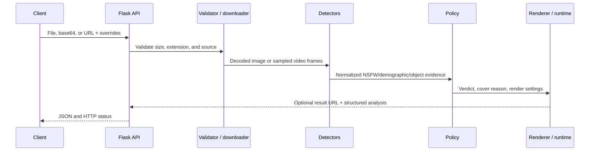

<a id="top"></a>

<div align="center">
  <a href="../README.md">
    
  </a>

  <h1>SafeVision Web API</h1>

  <p><strong>A deployable HTTP service for image and video safety analysis.</strong></p>
  <p>Upload files, submit base64 or remote URLs, select checks, apply regional censoring or whole-media covers, and retrieve auditable JSON.</p>

  <p>
    
    
    
    
  </p>

  <p>
    <a href="../README.md">Project home</a> ·
    <a href="#quick-start">Quick start</a> ·
    <a href="#endpoints">Endpoints</a> ·
    <a href="#rendering">Rendering</a> ·
    <a href="#deployment">Deployment</a> ·
    <a href="../Models/README.md">Model licenses</a>
  </p>
</div>

---

This folder is the deployable HTTP part of SafeVision. Detector code and models
stay in the project root; uploads, temporary downloads, generated results,
server configuration, and deployment files stay here.

The old command still works:

```powershell
python safevision_api.py
```

For a service installation, run the app from this folder with Waitress instead.

> [!WARNING]
> The service has no built-in end-user authentication. Its default loopback
> binding is appropriate for local/trusted use. Put authentication, HTTPS,
> rate limits, request controls, and outbound URL restrictions in front of it
> before exposing it to another network.

<table>
<tr>
<td width="25%" valign="top"><strong>🧠 Checks</strong><br>NSFW, estimated age, model-reported gender, and optional safety objects.</td>
<td width="25%" valign="top"><strong>🎭 Render</strong><br>Boxes, regional blur/masks, or full blur/gray/black/custom cover.</td>
<td width="25%" valign="top"><strong>📦 Media</strong><br>Images and sampled-policy video with downloadable results.</td>
<td width="25%" valign="top"><strong>🧾 Evidence</strong><br>Effective checks, demographics, qualified evidence, policy, and output JSON.</td>
</tr>
</table>

## 🗂️ Folder contents

- `app.py` — Flask routes and image/video processing.
- `web_config.py` — loads environment settings and resolves paths.
- `.env.example` — copy this to `.env` and edit it for the machine.
- `wsgi.py` — production WSGI entry point.
- `start.ps1` — small Windows Waitress launcher.
- `requirements.txt` — service-focused detector, Flask, and Waitress dependencies.
- `runtime/` — generated uploads, results, and temporary files; it is ignored by Git.

<a id="quick-start"></a>

## 🚀 Local Windows setup

Run these commands from the SafeVision project root:

```powershell
python -m venv .venv
Set-ExecutionPolicy -Scope Process Bypass
.\.venv\Scripts\Activate.ps1
python -m pip install --upgrade pip
python -m pip install -r ".\SafeVision Web API\requirements.txt"
Copy-Item ".\SafeVision Web API\.env.example" ".\SafeVision Web API\.env"
```

Open `.env` and confirm these model paths:

```ini
SAFEVISION_NSFW_MODEL=Models/best.onnx
SAFEVISION_AGE_GENDER_MODEL=Models/onnx-communityage-gender-prediction-ONNX.onnx
SAFEVISION_RULE_FILE=BlurException.rule
```

Start a local-only service:

```powershell
Set-Location ".\SafeVision Web API"
.\start.ps1
```

The default address is `http://127.0.0.1:5000`. Check it from a second terminal:

```powershell
curl.exe http://127.0.0.1:5000/api/v1/health
```

For a quick development run, use `python app.py`. Do not expose Flask debug mode to the internet.

<a id="endpoints"></a>

## 🔌 Endpoint map

| Method | Path | Input | Purpose |
|---|---|---|---|
| `GET` | `/api/v1/health` | — | Runtime/model/service health |
| `POST` | `/api/v1/detect` | multipart file | General image/video analysis and optional rendering |
| `POST` | `/api/v1/detect/base64` | JSON/base64 | General base64 analysis |
| `GET` | `/api/v1/detect/url` | URL query | General remote URL analysis |
| `GET` | `/api/v1/detect/media` | URL query | Compatibility media URL route |
| `POST` | `/api/v1/detect/demographics` | multipart file | Dedicated age/gender workflow |
| `POST` | `/api/v1/detect/demographics/base64` | JSON/base64 | Dedicated base64 demographics |
| `GET` | `/api/v1/detect/demographics/url` | URL query | Dedicated URL demographics |
| `GET` | `/api/v1/results/<filename>` | result name | Download an unexpired rendered artifact |
| `GET` | `/api/v1/labels` | — | Supported detector labels |
| `GET` | `/api/v1/stats` | — | In-process request statistics |

### Processing flow



## 🧪 Request examples

### Analyze an image with NSFW, age, and gender checks

```powershell
curl.exe -X POST `
  -F "file=@..\input\photo.jpg" `
  -F "checks=nude,age,gender" `
  http://127.0.0.1:5000/api/v1/detect
```

This normally returns JSON only. With the default
`protection_forces_full_cover=true`, a blocking child-protection verdict still
creates a covered result so the service never returns an uncovered "safe"
artifact for a blocked request. Send `protection_forces_full_cover=false` when
an integration intentionally needs a JSON-only verdict.

### Regional blur without boxes

```powershell
curl.exe -X POST `
  -F "file=@..\input\photo.jpg" `
  -F "checks=nude,age,gender" `
  -F "blur=true" `
  -F "boxes=false" `
  http://127.0.0.1:5000/api/v1/detect
```

If the child-protection policy blocks the image, the renderer automatically changes from regional blur to the configured full cover.

### Boxes only

```powershell
curl.exe -X POST `
  -F "file=@..\input\photo.jpg" `
  -F "checks=nude,age,gender" `
  -F "boxes=true" `
  http://127.0.0.1:5000/api/v1/detect
```

Box outputs are not redacted. Treat them as reviewer/debug artifacts and do not publish them as safe copies.

### Force a solid gray cover

```powershell
curl.exe -X POST `
  -F "file=@..\input\photo.jpg" `
  -F "checks=nude,age,gender" `
  -F "full_cover=true" `
  -F "full_cover_mode=gray" `
  -F "full_cover_show_text=true" `
  http://127.0.0.1:5000/api/v1/detect
```

`gray`, `black`, and `color` replace every source pixel. `blur` is visually obscured but still retains the source's broad colors and shapes.

### Custom solid color and message

```powershell
curl.exe -X POST `
  -F "file=@..\input\photo.jpg" `
  -F "full_cover=true" `
  -F "full_cover_mode=color" `
  -F "full_cover_color=#2c3140" `
  -F "full_cover_message=Unavailable under this content policy" `
  http://127.0.0.1:5000/api/v1/detect
```

API colors accept `#RRGGBB` or OpenCV `B,G,R` notation.

### Video analysis and rendering

```powershell
curl.exe -X POST `
  -F "file=@..\input\clip.mp4" `
  -F "checks=nude,age,gender" `
  -F "max_frames=90" `
  -F "sample_seconds=0.5" `
  -F "blur=true" `
  -F "boxes=false" `
  -F "full_cover_mode=gray" `
  http://127.0.0.1:5000/api/v1/detect
```

The video is sampled for its policy decision. When that policy blocks, the generated video is covered for every frame. Regional NSFW blur/box rendering scans output frames. The local API's OpenCV renderer does not keep audio; use `video.py --with-audio` or an FFmpeg post-processing step when audio must be retained.

### Age and gender only

```powershell
curl.exe -X POST `
  -F "file=@..\input\photo.jpg" `
  http://127.0.0.1:5000/api/v1/detect/demographics
```

### Remote URL

```powershell
curl.exe "http://127.0.0.1:5000/api/v1/detect/url?url=https://example.com/photo.jpg&checks=nude,age,gender&blur=true&full_cover_mode=gray"
```

Do not enable the URL endpoint on an untrusted network without outbound-network restrictions and a reverse proxy.

<a id="rendering"></a>

## 🎭 Render parameters

| Parameter | Values | Meaning |
|---|---|---|
| `blur` | `true` / `false` | Censor matching NSFW regions. |
| `boxes` | `true` / `false` | Draw unredacted detection boxes and labels. |
| `full_cover` | `true` / `false` | Force a whole-image/video cover. `full_blur` is accepted as a compatibility alias. |
| `full_cover_mode` | `blur`, `gray`, `black`, `color` | Select visually obscured or solid replacement output. |
| `full_cover_color` | `#RRGGBB` or `B,G,R` | Solid color for `color` mode. |
| `full_cover_show_text` | `true` / `false` | Show the centered reason text. |
| `full_cover_text_color` | `#RRGGBB` or `B,G,R` | Warning text color. |
| `full_cover_message` | text | Override the automatic message for this request. |
| `protection_forces_full_cover` | `true` / `false` | Automatically create a full-covered result when child protection blocks (default: `true`). |

Policy overrides are also accepted per request:

- `block_if_nsfw_and_child` (alias `block_if_nsfw_and_underage`)
- `block_if_child` (alias `block_if_underage`)
- `block_on_age_review`
- `underage_age`, `age_review_margin`
- `child_nsfw_min_risk` / `protection_nsfw_min_risk`
- `child_nsfw_min_confidence` / `protection_nsfw_min_confidence`

The response repeats the effective values in `policy_settings`, which makes
request-specific decisions auditable.

The automatic messages come from the selected `.rule` file:

- NSFW-only full cover: `Explicit content hidden`
- qualified NSFW + estimated underage: `Possible illegal content - review required`
- underage-only rule: `Estimated underage person - review required`
- near-threshold age-review rule: `Age review required`

These messages describe an automated policy result. They are deliberately cautious and are not legal conclusions.

## 📥 Result download

A rendered response contains an `output` object:

```json
{
  "output": {
    "rendered": true,
    "url": "/api/v1/results/REQUEST_ID_photo.jpg",
    "full_cover_applied": true,
    "full_cover_mode": "gray",
    "full_cover_reason": "nsfw_and_child",
    "full_cover_message": "Possible illegal content - review required"
  }
}
```

Download it from the same server:

```powershell
curl.exe -o result.jpg http://127.0.0.1:5000/api/v1/results/REQUEST_ID_photo.jpg
```

Generated files expire according to `SAFEVISION_API_MAX_FILE_AGE`.

## ⚙️ Environment reference

The common settings are:

- `SAFEVISION_API_HOST`, `SAFEVISION_API_PORT`, `SAFEVISION_API_DEBUG`
- `SAFEVISION_API_MAX_UPLOAD_MB`, `SAFEVISION_API_MAX_URL_MB`
- `SAFEVISION_RULE_FILE`
- `SAFEVISION_NSFW_MODEL`, `SAFEVISION_AGE_GENDER_MODEL`
- `SAFEVISION_DETECTORS`
- `SAFEVISION_UNDERAGE_AGE`, `SAFEVISION_AGE_REVIEW_MARGIN`
- `SAFEVISION_BLOCK_IF_NSFW_AND_CHILD`
- `SAFEVISION_PROTECTION_FORCES_FULL_COVER`
- `SAFEVISION_FULL_COVER_MODE`, `SAFEVISION_FULL_COVER_COLOR`
- `SAFEVISION_FULL_COVER_TEXT_COLOR`, `SAFEVISION_FULL_COVER_SHOW_TEXT`
- `SAFEVISION_API_UPLOAD_FOLDER`, `SAFEVISION_API_OUTPUT_FOLDER`, `SAFEVISION_API_TEMP_FOLDER`

Environment variables take priority over `.env`. Relative paths are resolved from the SafeVision project root.

<a id="deployment"></a>

## 🚢 Website/server deployment

The simplest deployment is Waitress behind an HTTPS reverse proxy.

1. Copy the SafeVision project to the server.
2. Create a virtual environment and install `SafeVision Web API/requirements.txt`.
3. Put both ONNX models in the configured model directory.
4. Copy `.env.example` to `.env`; use absolute model, rule, and runtime paths.
5. Keep `SAFEVISION_API_DEBUG=false`.
6. Run Waitress on a private loopback port.
7. Put Nginx, Apache, Caddy, or your hosting panel in front of it for TLS, request limits, and authentication.

Example Linux service command, run from `SafeVision Web API`:

```bash
/srv/safevision/.venv/bin/python -m waitress --host=127.0.0.1 --port=5000 wsgi:app
```

Minimal Nginx location for a dedicated hostname (for example,
`safevision.example.com`):

```nginx
location / {
    proxy_pass http://127.0.0.1:5000/;
    proxy_set_header Host $host;
    proxy_set_header X-Forwarded-For $proxy_add_x_forwarded_for;
    proxy_set_header X-Forwarded-Proto $scheme;
    client_max_body_size 50m;
    proxy_read_timeout 300s;
}
```

Before public deployment, add an authentication layer, rate limits, upload/content limits, HTTPS, restricted CORS origins, outbound URL controls, retention cleanup, and access-log redaction. The standalone local API is intended for trusted networks; `vision2` is the codebase with the fuller live-service/admin controls.

## 🧯 Error behavior

| HTTP status | Typical cause | Correct response |
|---:|---|---|
| `400` | Missing/invalid file, base64, URL, option, or filename | Fix request shape and values |
| `404` | Result expired or does not exist | Re-run analysis; do not guess filenames |
| `413` | Upload or remote download exceeds configured size | Reduce input or intentionally change limits |
| `415` | Unsupported media type or undecodable content | Transcode to a supported image/video format |
| `500` | Unexpected processing/rendering failure | Inspect server logs without exposing private request data |
| `503` | Requested ONNX model is unavailable or incompatible | Fix model path/runtime, or disable that check intentionally |

### Model error behavior

The NSFW model is loaded at startup. Age/gender is loaded when an age or gender request first needs it. If an enabled model is missing, the API returns an actionable error containing the configured path. Disabling `age` and `gender` lets NSFW-only requests run without the age/gender model.

Age and gender are estimates from visible faces. Do not use them as identity, legal-age proof, or the sole basis of a consequential decision.

## 🔒 Production checklist

- [ ] Bind Waitress to a private address behind an HTTPS reverse proxy
- [ ] Add authentication and authorization
- [ ] Apply rate, body-size, concurrency, and timeout limits
- [ ] Restrict URL downloads to approved schemes/hosts/networks
- [ ] Prevent access to loopback, link-local, and cloud metadata services
- [ ] Use isolated runtime folders with least-privilege permissions
- [ ] Define result/upload retention and run cleanup
- [ ] Redact request paths, URLs, and demographic fields from ordinary access logs
- [ ] Record model hashes, model licenses, rule version, and effective config
- [ ] Test solid covers and blocked-result behavior before public use

> [!IMPORTANT]
> Source code and model weights have separate licenses. Read the
> [model registry](../Models/README.md) and
> [licensing guide](../docs/LICENSING.md) before distributing a container or
> approving commercial production use.

---

<div align="center">

### Continue exploring

[](../README.md)
[](../rule_templates/README.md)
[](../Models/README.md)

<br>

<a href="#top">⬆️ Back to top</a>

</div>
