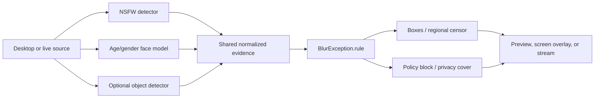

<a id="top"></a>

<div align="center">
  <a href="../README.md">
    
  </a>

  <h1>SafeVision Applications</h1>

  <p><strong>The visual and real-time application layer.</strong></p>
  <p>Desktop workflows, camera monitoring, screen protection, OBS integration, and virtual-camera output live here.</p>

  <p>
    
    
    
  </p>

  <p>
    <a href="../README.md">Project home</a> ·
    <a href="desktop/README.md">Desktop GUI</a> ·
    <a href="live/README.md">Live tools</a> ·
    <a href="../Models/README.md">Models</a> ·
    <a href="../docs/README.md">Documentation</a>
  </p>
</div>

---

> [!TIP]
> Existing commands such as `python SafeVisionGUI.py` and `python live.py`
> still work. The root files are intentionally small compatibility launchers;
> maintained implementations are organized below this folder.

## 🗂️ Layout

```text
apps/
├── README.md
├── desktop/
│   ├── SafeVisionGUI.py      Full PyQt5 interface implementation
│   ├── __init__.py
│   └── README.md             GUI setup, controls, privacy, and development
└── live/
    ├── live.py               Local camera processing
    ├── safeVisionScreenGuard.py
    ├── live_streamer.py      OBS and virtual-camera workflow
    ├── __init__.py
    └── README.md             Complete real-time operations manual
```

## 🚀 Launch map

| Experience | Stable command | Direct package command | Detailed guide |
|---|---|---|---|
| Desktop GUI | `python SafeVisionGUI.py` | `python -m apps.desktop.SafeVisionGUI` | [Desktop README](desktop/README.md) |
| Live camera | `python live.py -c 0` | `python -m apps.live.live -c 0` | [Live README](live/README.md#live-camera) |
| Screen Guard | `python safeVisionScreenGuard.py --list-monitors` | `python -m apps.live.safeVisionScreenGuard --list-monitors` | [Live README](live/README.md#screen-guard) |
| OBS/streamer | `python live_streamer.py -i camera` | `python -m apps.live.live_streamer -i camera` | [Live README](live/README.md#live-streamer) |

The all-in-one command console can launch the same applications:

```powershell
python safeVisionCLI.py launch gui
python safeVisionCLI.py launch live -- -c 0
python safeVisionCLI.py launch screen -- --list-monitors
python safeVisionCLI.py launch streamer -- -i camera
```

## 🧠 Shared processing contract



All application entry points share the project-root components:

- `safevision_utils.py` for rule parsing, providers, evidence normalization,
  and policy evaluation;
- `age_gender_detector.py` for batched face inference;
- `video.py` for the Screen Guard NSFW detector implementation;
- `BlurException.rule` for active label and child-protection decisions;
- `Models/` for local ONNX files;
- `settings/configs.json` for the command console and Screen Guard defaults.

## 🔒 Path and privacy guarantees

Moving the implementation files does not move runtime data. Every application
resolves `PROJECT_ROOT` back to the repository root, so model, rule, engine,
and settings paths remain stable.

| Item | Resolved location | Git behavior |
|---|---|---|
| NSFW model | `Models/best.onnx` | Tracked model; see model license |
| Age/gender model | `Models/onnx-communityage-gender-prediction-ONNX.onnx` | Ignored large local file |
| Active rule | `BlurException.rule` | Tracked configuration |
| GUI preferences | `safevision_settings.json` | Ignored local file |
| Media output | Project runtime folders | Contents ignored |

> [!WARNING]
> Demographic boxes and ordinary detection boxes are review aids, not censored
> output. Use blur/block/privacy modes when visual protection is required.

## 🛠️ Developer notes

The root compatibility launchers deliberately re-export implementation symbols,
so older imports continue to work while new code can import the package path:

```python
from apps.desktop.SafeVisionGUI import SafeVisionGUI
from apps.live.safeVisionScreenGuard import ScreenGuard
```

When changing an application:

1. edit the implementation under `apps/`;
2. keep root launchers tiny and argument-transparent;
3. resolve repository resources through `PROJECT_ROOT`;
4. update the relevant folder README and the main command map;
5. run help/import checks from both the stable and direct package paths;
6. test with a safe synthetic fixture before using sensitive media.

```powershell
python -m py_compile `
  .\apps\desktop\SafeVisionGUI.py `
  .\apps\live\live.py `
  .\apps\live\safeVisionScreenGuard.py `
  .\apps\live\live_streamer.py

python live.py --help
python -m apps.live.live --help
python safeVisionScreenGuard.py --help
python -m apps.live.safeVisionScreenGuard --help
```

## 📚 Continue reading

<table>
<tr>
<td width="50%" valign="top">

### 🖥️ Desktop GUI

Visual file selection, processing controls, rule selection, output previews,
FFmpeg discovery, and privacy-aware copy switches.

**[Open the Desktop GUI guide →](desktop/README.md)**

</td>
<td width="50%" valign="top">

### 📡 Live tools

Camera monitoring, Windows screen overlays, OBS scene switching, virtual
cameras, smoothing, capture-loop prevention, and performance tuning.

**[Open the Live tools guide →](live/README.md)**

</td>
</tr>
</table>

<p align="right"><a href="#top">⬆️ Back to top</a></p>
