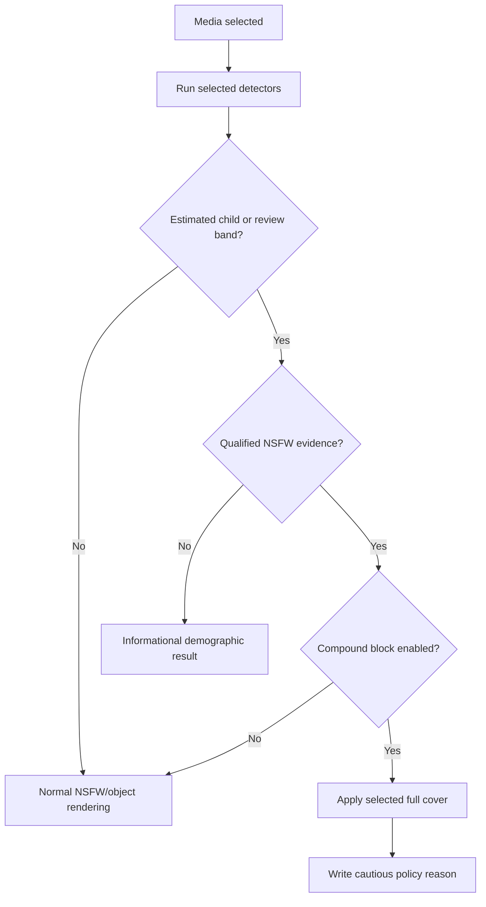

<a id="top"></a>

<div align="center">
  <a href="../../README.md">
    
  </a>

  <h1>SafeVision Desktop GUI</h1>

  <p><strong>A visual control room for image and video moderation.</strong></p>
  <p>Select media, choose detectors and rules, preview outputs, and control exactly which artifacts are saved.</p>

  <p>
    
    
    
  </p>

  <p>
    <a href="../../README.md">Project home</a> ·
    <a href="../README.md">Applications</a> ·
    <a href="../live/README.md">Live tools</a> ·
    <a href="../../rule_templates/README.md">Rule presets</a>
  </p>
</div>

---

## 🚀 Start the GUI

Install the project dependencies from the repository root:

```powershell
python -m venv .venv
Set-ExecutionPolicy -Scope Process Bypass
.\.venv\Scripts\Activate.ps1
python -m pip install -r requirements.txt
python SafeVisionGUI.py
```

The organized implementation can also be launched directly:

```powershell
python -m apps.desktop.SafeVisionGUI
```

> [!NOTE]
> `SafeVisionGUI.py` at the repository root is a compatibility launcher. The
> maintained implementation is `apps/desktop/SafeVisionGUI.py`; both commands
> open the same interface and resolve models, rules, engines, and output paths
> from the repository root.

## 🧭 Recommended first workflow

1. Open an image or short test video from the input area.
2. Keep the detector set at **NSFW + age + gender** for a complete analysis.
3. Choose `01_balanced_default.rule` or another documented preset.
4. Enable **Regional censoring** and disable **Boxes on final output**.
5. Keep **Save reviewer boxes copy** off unless an authorized reviewer needs it.
6. Choose a solid full-cover mode when a policy block must reveal no source
   pixels.
7. Start processing and inspect the preview plus analysis/report files.

> [!TIP]
> For a public-facing image, the safest common setup is regional censoring on,
> final boxes off, reviewer copy off, clean censor copy on, and an opaque gray
> or black full cover for policy blocks.

## 🗺️ Control map

| Area | Main controls | What it changes |
|---|---|---|
| Input | File picker, drag/drop, tree preview | Source image or video |
| Detector Models | NSFW/objects selection, age, gender, thresholds | Which ONNX sessions run |
| Protection Policy | compound rule, child-only rule, review band, risk/confidence | Whether the result is allowed or blocked |
| Regional Censor | blur/color, mask shape, strength, color | Matching detection regions |
| Output Privacy | final boxes, reviewer copy, clean copy | Which artifacts may expose source pixels |
| Full Cover | force, mode, color, text, message | Whole-image/video replacement |
| Video | audio, codec, delete frames, reports, markers | Video rendering and export workflow |
| Advanced | `.rule` file and script paths | Profile and engine selection |
| Preview | included/excluded files, image/video viewer | Local review only |

## 🧠 Detector selection

The GUI builds the same detector list accepted by `main.py` and `video.py`.

| GUI choice | Effective checks | Required model files |
|---|---|---|
| NSFW | `nude` | `Models/best.onnx` |
| Objects | `objects` | `Models/safety_objects.onnx` + labels JSON |
| Both | `nude,objects` | Both detector models |
| Age enabled | adds `age` | Age/gender ONNX model |
| Gender enabled | adds `gender` | Age/gender ONNX model |

Age and gender share one inference session, but the output fields can be
enabled independently. A missing age/gender model is an error only when one of
those checks is enabled.

## 🛡️ Protection logic in the GUI



The balanced profile does not block an ordinary family photo merely because a
face is estimated below the threshold. It requires qualified NSFW evidence at
the selected risk and confidence gate unless **Block any estimated child** is
explicitly enabled.

<a id="rendering-output-copies"></a>

## 🎭 Rendering and output copies

| Output option | Source pixels visible? | Boxes? | Normal purpose |
|---|:---:|:---:|---|
| Final image with boxes | Yes outside detections | Yes | Authorized review/debug |
| Regional blurred image | Yes outside censored regions | Optional | General moderation output |
| Regional color mask | Yes outside censored regions | Optional | Stronger local redaction |
| Full blur | Derived shapes/colors remain | Optional text | Visual suppression with context |
| Gray/black/custom cover | **No** | No | Policy block or public rejection artifact |
| Reviewer copy (`Prosses/`) | **Yes** | Yes | Restricted reviewer workflow only |
| Clean censor copy (`Blur/`) | Only outside protected regions | No | Shareable result when policy permits |

> [!WARNING]
> Enabling the reviewer copy deliberately creates an unredacted artifact with
> annotations. It is not a safe output and should never be published as the
> censored result.

## 🎬 Video behavior

For videos, the GUI delegates to `video.py` and can configure:

- boxes and regional censoring;
- monitoring thresholds and automatic full-video cover;
- forced whole-video gray, black, color, or blur output;
- JSON/CSV reports and EDL/FCPXML marker exports;
- audio preservation through FFmpeg;
- temporary-frame cleanup;
- analyze-only mode for fast review before rendering.

FFmpeg is auto-detected from `PATH`, common Windows locations, or the project
`ffmpeg/` directory. A custom executable path can be saved in GUI preferences.

## ⚙️ Settings and path resolution

The GUI stores local preferences in:

```text
safevision_settings.json
```

That file is created at the repository root and ignored by Git. It is separate
from `settings/configs.json`, which belongs to `safeVisionCLI.py` and Screen
Guard. Relative model and rule paths resolve from the repository root even
though the GUI implementation is nested under `apps/desktop/`.

The interface auto-detects:

```text
main.py
video.py
BlurException.rule
rule_templates/*.rule
Models/*.onnx
ffmpeg.exe or ffmpeg on PATH
```

## 🔍 Equivalent command preview

The GUI ultimately creates a normal CLI command. A representative public-image
configuration is equivalent to:

```powershell
python main.py `
  -i ".\input\photo.jpg" `
  -o ".\output\photo_checked.jpg" `
  -b --no-boxes `
  --no-save-boxes-copy --save-blur-copy `
  --detectors nude,age,gender `
  -e ".\rule_templates\01_balanced_default.rule" `
  --full-cover-mode gray --full-cover-text
```

Use the GUI output log to inspect the exact command unless **Hide command** is
enabled.

## 🧯 Troubleshooting

<details>
<summary><strong>The GUI opens but processing cannot find main.py or video.py</strong></summary>

Start the GUI from the repository root, or use the stable root launcher:

```powershell
Set-Location C:\path\to\SafeVision
python SafeVisionGUI.py
```

The Advanced tab also lets you select each script manually.

</details>

<details>
<summary><strong>Age/gender is enabled but the model is missing</strong></summary>

Place the model at:

```text
Models/onnx-communityage-gender-prediction-ONNX.onnx
```

Then run `python safeVisionCLI.py status`. If demographics are intentionally
disabled, turn both Age and Gender off in Detector Models.

</details>

<details>
<summary><strong>Video output has no audio</strong></summary>

Enable **Include audio**, install FFmpeg, and verify the GUI reports a valid
FFmpeg path. OpenCV alone cannot preserve the original audio stream.

</details>

<details>
<summary><strong>A safe image was fully covered</strong></summary>

Inspect the analysis JSON and selected `.rule` profile. Restore the balanced
profile, keep `BLOCK_IF_CHILD=false`, and confirm the compound gate is HIGH risk
at confidence 0.5 or above. See the
[rule catalog](../../rule_templates/README.md).

</details>

## 🛠️ Development

The GUI is intentionally a subprocess-based front end. Detection and rendering
logic should stay in shared engines instead of being duplicated in Qt event
handlers.

```powershell
python -m py_compile .\apps\desktop\SafeVisionGUI.py .\SafeVisionGUI.py
python -c "import SafeVisionGUI; print(SafeVisionGUI.SafeVisionGUI.__name__)"
```

When adding a control, update all four layers:

1. widget default and saved preference;
2. command builder and correct Boolean flag;
3. status/tooltip or visible explanation;
4. this README and the main capability map.

<p align="right"><a href="#top">⬆️ Back to top</a></p>
