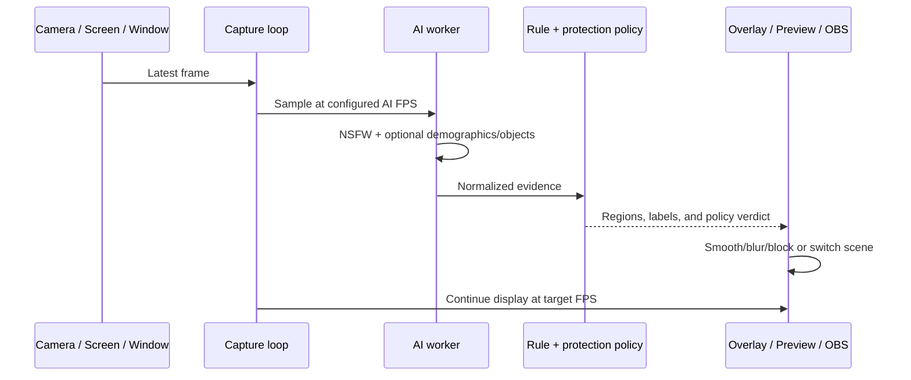

<a id="top"></a>

<div align="center">
  <a href="../../README.md">
    
  </a>

  <h1>SafeVision Live Tools</h1>

  <p><strong>Real-time camera, desktop, and streaming protection.</strong></p>
  <p>Run local previews, protect a monitor with a topmost overlay, or feed censored video into OBS and virtual-camera software.</p>

  <p>
    
    
    
    
  </p>

  <p>
    <a href="../../README.md">Project home</a> ·
    <a href="../README.md">Applications</a> ·
    <a href="../desktop/README.md">Desktop GUI</a> ·
    <a href="../../CHILD_PROTECTION.md">Protection policy</a>
  </p>
</div>

---

<table>
<tr>
<td width="33%" valign="top">

### 📷 Live camera

Local camera preview with regional blur/masks, demographic observations, and
policy alerts.

[`live.py`](#live-camera)

</td>
<td width="33%" valign="top">

### 🖥️ Screen Guard

Topmost monitor overlay for boxes, blur, blocks, and whole-screen privacy.

[`safeVisionScreenGuard.py`](#screen-guard)

</td>
<td width="33%" valign="top">

### 🎙️ Live Streamer

Camera/screen/window input, OBS scene switching, and optional virtual-camera
output.

[`live_streamer.py`](#live-streamer)

</td>
</tr>
</table>

## 📦 Installation

Install the main requirements from the repository root:

```powershell
python -m venv .venv
Set-ExecutionPolicy -Scope Process Bypass
.\.venv\Scripts\Activate.ps1
python -m pip install -r requirements.txt
```

The relevant packages are OpenCV, ONNX Runtime, NumPy, Pillow, MSS,
`obsws-python`, and `pyvirtualcam`. Screen Guard has its richest overlay and
capture behavior on Windows; camera and compatible MSS/OBS workflows can run on
other supported desktop platforms.

Verify providers and models before starting a live session:

```powershell
python safeVisionCLI.py status
python safeVisionCLI.py providers
```

<a id="live-camera"></a>

## 📷 Live camera

Start the default camera with all three primary checks:

```powershell
python live.py -c 0 --demographics
```

Privacy-oriented preview without demographic boxes:

```powershell
python live.py -c 0 --demographics --no-boxes --enhanced-blur
```

NSFW-only camera when the age/gender model is intentionally unavailable:

```powershell
python live.py -c 0 --no-demographics
```

| Option | Purpose |
|---|---|
| `-c`, `--camera` | OpenCV camera index, normally `0` for the first device |
| `--demographics` | Enable age and gender analysis; this is already the default |
| `--no-demographics` | Disable both age and gender checks |
| `--underage-age` | Override the estimated child threshold |
| `--age-review-margin` | Review band above the threshold |
| `--no-boxes` | Hide detection annotations |
| `--privacy` | Run without showing the camera window |
| `--enhanced-blur` | Stronger regional blur |
| `--solid-color` | Replace matched regions with a solid mask |
| `--auto-record` | Record when the alert condition is reached |
| `--skip-frames` | Analyze every Nth frame to reduce load |

> [!WARNING]
> `--privacy` hides the local display; it does not mean “do not process.” The
> camera frames still enter the local detector pipeline. Review recording and
> retention settings separately.

<a id="screen-guard"></a>

## 🖥️ Screen Guard

List monitors first:

```powershell
python safeVisionScreenGuard.py --list-monitors
```

Balanced regional blur on monitor 1:

```powershell
python safeVisionScreenGuard.py `
  --monitor 1 `
  --mode blur `
  --detectors nsfw,age,gender `
  --exposed-only `
  --respect-rules `
  --show-status `
  --no-boxes
```

Opaque region blocking:

```powershell
python safeVisionScreenGuard.py `
  --monitor 1 --mode block `
  --block-color 0,0,0 `
  --exposed-only --respect-rules
```

Whole-monitor privacy whenever matching evidence appears:

```powershell
python safeVisionScreenGuard.py `
  --monitor 1 --mode privacy `
  --detectors nsfw,age,gender `
  --hide-demographics
```

### Screen Guard modes

| Mode | Localized boxes | Localized blur | Solid region block | Whole-monitor privacy |
|---|:---:|:---:|:---:|:---:|
| `box` | ✅ | — | — | — |
| `blur` | Optional | ✅ | — | Policy-dependent |
| `block` | Optional | — | ✅ | Policy-dependent |
| `both` | ✅ | ✅ | Optional flags | Policy-dependent |
| `privacy` | Optional | Optional | Optional | ✅ on detection |

### Stable overlay controls

Screen Guard tracks and smooths detections so the overlay does not flicker on
every missed frame.

| Setting | Effect |
|---|---|
| `--smooth-overlay` | Track boxes and avoid unnecessary redraws |
| `--smooth-iou` | Overlap required to associate a new detection with a track |
| `--smooth-alpha` | How quickly geometry follows movement |
| `--track-hold-ms` | Short grace period through missed detections |
| `--merge-nearby` | Join nearby detections into a continuous protected region |
| `--drop-stale-on-screen-change` | Release held boxes after the underlying screen changes |
| `--feedback-safe-capture` | Briefly hide the overlay during capture to avoid self-detection |
| `--exclude-overlay-capture` | Ask Windows to exclude the overlay from supported captures |

> [!TIP]
> If the overlay detects its own blur or boxes, enable feedback-safe capture,
> keep overlay capture excluded, and reduce `--track-hold-ms` before lowering
> the moderation threshold.

### Saved Screen Guard profile

`python safeVisionCLI.py screen` builds Screen Guard arguments from
`settings/configs.json`:

```powershell
python safeVisionCLI.py settings show
python safeVisionCLI.py screen
```

The `screen_guard` section owns monitor, mode, FPS, smoothing, capture backend,
labels, box visibility, privacy, colors, and click-through behavior.

<a id="live-streamer"></a>

## 🎙️ Live Streamer

Camera input with local processing:

```powershell
python live_streamer.py `
  -i camera -c 0 `
  --detectors nsfw,age,gender `
  --show-demographics `
  --quality medium
```

Screen input for OBS:

```powershell
python live_streamer.py `
  -i screen -m 1 `
  --resolution 1920x1080 `
  --fps 30 --ai-fps 5 `
  --detectors nsfw,age,gender `
  --auto-scene-switch `
  --obs-host localhost --obs-port 4455
```

Virtual-camera output:

```powershell
python live_streamer.py `
  -i camera -c 0 `
  --virtual-cam --vcam-fps 30 `
  --privacy
```

### OBS checklist

1. Install OBS Studio and enable its WebSocket server.
2. Confirm the WebSocket host, port, and password.
3. Create safe and unsafe scenes before enabling automatic scene switching.
4. Test scene names and behavior with synthetic content.
5. Keep a manual emergency scene/hotkey available.
6. Validate that the stream receives the censored/virtual source, not the raw
   camera or desktop source.

> [!CAUTION]
> A preview can look safe while OBS is still streaming a different source.
> Verify the actual program output and recording path before a real broadcast.

## 🧠 Real-time policy flow



Capture/render FPS and AI FPS are deliberately separate. The display can stay
smooth while the heavier ONNX pipeline samples fewer frames.

## ⚡ Performance tuning

| Symptom | First adjustment | Next adjustment |
|---|---|---|
| High CPU | Increase camera `--skip-frames` or lower streamer `--ai-fps` | Lower resolution/quality |
| Overlay lag | Lower Screen Guard `--fps` but retain overlay FPS | Reduce capture resolution |
| Flicker | Enable smoothing and increase short track hold | Tune IoU and alpha |
| Boxes trail old content | Enable drop-on-screen-change | Lower track hold and stale delta |
| GPU provider unavailable | Inspect `safeVisionCLI.py providers` | Return to CPU provider |
| Multiple faces are slow | Reuse NSFW face boxes with `nsfw,age,gender` | Reduce face padding/minimum size carefully |

Do not solve performance problems by silently weakening a production policy.
Record changed thresholds and validate them against representative content.

## 🔒 Privacy and operations

- Live tools process frames locally unless you connect external streaming or
  recording software.
- Screen Guard does not intentionally save captured frames.
- `--auto-record`, OBS, virtual cameras, and third-party plugins create separate
  data flows that need their own retention and access controls.
- Demographic estimates are not identity or legal-age verification.
- A child observation alone does not prove harmful content.
- Keep a trained human review path for high-impact outcomes.
- Prefer solid blocks/privacy covers when no underlying pixels may be visible.

## 🧯 Troubleshooting

<details>
<summary><strong>No camera opens</strong></summary>

Try another camera index, close applications already using the camera, and
confirm OS camera permission:

```powershell
python live.py -c 1 --no-demographics
```

</details>

<details>
<summary><strong>Screen Guard is visible but does not protect the right monitor</strong></summary>

Run `--list-monitors`, use the reported number, and verify display scaling. Test
with boxes/status first, then switch to blur/block/privacy.

</details>

<details>
<summary><strong>OBS connection fails</strong></summary>

Confirm OBS is running, WebSocket is enabled, port `4455` is reachable, and the
password matches. `obsws-python` must be installed in the same environment.

</details>

<details>
<summary><strong>The virtual camera option is unavailable</strong></summary>

Install `pyvirtualcam` and a compatible virtual-camera driver. On Windows, OBS
Virtual Camera is a common provider. Restart consuming applications after the
driver becomes available.

</details>

<details>
<summary><strong>The age/gender model is missing</strong></summary>

Place the model at the documented path or explicitly run an NSFW-only session:

```powershell
python live.py --no-demographics
python safeVisionScreenGuard.py --detectors nsfw --hide-demographics
python live_streamer.py --detectors nsfw
```

</details>

## 🛠️ Development and compatibility

Maintained implementations are in this folder. Stable root launchers re-export
the same public classes/functions and forward command-line arguments.

```powershell
python live.py --help
python -m apps.live.live --help

python safeVisionScreenGuard.py --help
python -m apps.live.safeVisionScreenGuard --help

python live_streamer.py --help
python -m apps.live.live_streamer --help
```

When editing a live tool, keep capture, inference, policy, and rendering as
separate stages. Avoid doing ONNX work on the GUI/overlay redraw thread, and do
not add automatic recording without a visible, documented control.

<p align="right"><a href="#top">⬆️ Back to top</a></p>
