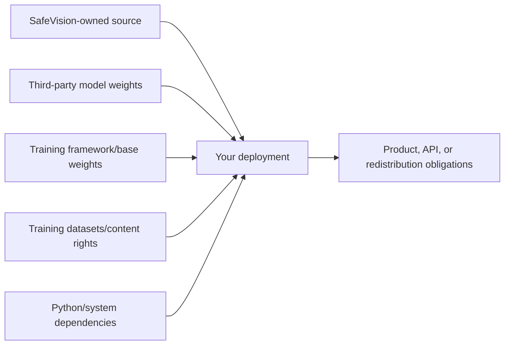

<a id="top"></a>

<div align="center">
  <a href="../README.md">
    
  </a>

  <h1>SafeVision Licensing Guide</h1>

  <p><strong>Software, model weights, datasets, dependencies, and product attribution are separate rights layers.</strong></p>

  <p>
    
    
    
  </p>

  <p>
    <a href="../README.md">Project home</a> ·
    <a href="../LICENSE">License text</a> ·
    <a href="../NOTICE">Notices</a> ·
    <a href="../Models/README.md">Model registry</a>
  </p>
</div>

---

> [!WARNING]
> This guide explains the repository's documented licensing position; it is
> not legal advice. A company deploying SafeVision should have counsel review
> the exact release, model files, dependency licenses, training data, product
> architecture, and intended distribution/service model.

## 🧭 The five rights layers



A permission at one layer does not grant permission at another. In particular,
the repository license cannot convert an AGPL model into Apache-2.0 or grant
rights in an unknown model.

## 💻 Software source

The exact license governing the SafeVision-owned source in a release is the
root [`LICENSE`](../LICENSE) shipped with that release. Preserve it and the
root [`NOTICE`](../NOTICE) when copying or distributing covered material.

The current checkout uses Apache License 2.0. It permits commercial use,
modification, and redistribution of the covered SafeVision-owned source,
subject to the license conditions. A source or binary redistribution must keep
the required license and applicable attribution notices; the SafeVision
attribution line is recorded in `NOTICE`. For a hosted integration that does
not distribute SafeVision, the project still asks the operator to show the
same acknowledgment, while the exact Apache-2.0 legal obligation depends on
how the software is delivered. This paragraph does not grant rights in the
separately licensed model files.

Earlier public SafeVision versions were released under Apache License 2.0.
Those recipients retain the permissions granted for those versions. A future
release can use different terms for new SafeVision-owned work when the
copyright holder has the right to make that change, but it cannot revoke rights
already granted for old copies or relicense third-party material.

## 🧠 Model weights

| Model | Documented status | Safe commercial conclusion |
|---|---|---|
| `best.onnx` | Embedded Ultralytics AGPL-3.0 metadata | Proprietary deployment is **not cleared by the SafeVision source license**; evaluate AGPL compliance or obtain appropriate Ultralytics commercial terms |
| `safety_objects.onnx` | SafeVision fine-tuning/export, but pretrained Ultralytics YOLO and embedded AGPL-3.0 | Same upstream Ultralytics boundary; also verify every training dataset license |
| Age/gender ONNX | Hugging Face model card says Apache-2.0 | Apache-2.0 permits commercial use subject to its terms and notices; privacy/use-case law remains separate |
| Legacy `best_gender.onnx` | Origin and license unknown | Do not redistribute or approve for production until rights are established |

Read the full [model registry](../Models/README.md) for hashes, embedded
metadata, origin evidence, and release checks.

## 🏢 Commercial-use scenarios

<details open>
<summary><strong>Company uses only SafeVision-owned source and supplies its own cleared model</strong></summary>

Follow the source license/NOTICE for that release and the company's own model,
dataset, dependency, privacy, and deployment obligations. This is the cleanest
way to avoid inheriting an unclear bundled-model provenance chain.

</details>

<details>
<summary><strong>Company uses the Apache-2.0 age/gender model</strong></summary>

Preserve the model's Apache-2.0 license/attribution and source model-card link.
Also evaluate biometric/privacy rules, bias, human review, and whether estimated
age/gender is lawful for the intended decision. Apache licensing alone does not
make a deployment legally or ethically suitable.

</details>

<details>
<summary><strong>Company uses best.onnx or safety_objects.onnx</strong></summary>

The audited binaries declare Ultralytics AGPL-3.0. Ultralytics currently states
that its trained/fine-tuned models are AGPL by default and that proprietary or
closed commercial deployments require its Enterprise terms. The company must
evaluate the exact obligations with Ultralytics/counsel; SafeVision cannot sell
or waive rights owned by Ultralytics.

</details>

<details>
<summary><strong>Company wants the old best_gender.onnx</strong></summary>

No embedded license or reliable origin was found. Absence of a license is not
permission. The model should remain excluded until the rightsholder and terms
are documented in writing.

</details>

## 🏷️ Attribution and notices

At minimum, a redistribution should keep:

- the exact root `LICENSE` from the used SafeVision release;
- the root `NOTICE` file;
- a statement that the product includes or is based on SafeVision, with a link
  to `https://github.com/im-syn/SafeVision`;
- each included model's original license, model-card URL, and notices;
- dependency notices required by packaged Python/system components;
- modification notices where the applicable license requires them.

A clear attribution example is:

```text
This product includes software from SafeVision
(https://github.com/im-syn/SafeVision) and separately licensed model files.
See the accompanying LICENSE, NOTICE, and model-license documents.
```

Do not describe a modified product as “official SafeVision” or imply maintainer
endorsement without permission. License notices and trademark/endorsement are
separate issues.

## 🔁 Modification and redistribution

Before redistributing a build or container:

1. inventory every copied source file, model, wheel, native library, and binary;
2. attach the exact licenses/notices for each artifact;
3. mark significant SafeVision code modifications;
4. verify model/base-weight/dataset redistribution rights;
5. decide whether AGPL source-offer/network obligations apply;
6. avoid the unknown legacy model;
7. preserve SafeVision and upstream attribution;
8. repeat the audit when any model hash changes.

## 🚫 What SafeVision cannot authorize

The SafeVision maintainer cannot independently grant:

- an Ultralytics Enterprise license;
- rights in unknown-origin `best_gender.onnx`;
- rights in third-party datasets, images, faces, or annotations;
- rights in dependencies beyond their upstream licenses;
- permission to violate privacy, biometric, child-safety, export, or platform
  rules.

## ✅ Professional release checklist

- [ ] Source license selected and copied unchanged
- [ ] NOTICE updated and included
- [ ] Model inventory and hashes recorded
- [ ] Embedded ONNX metadata inspected
- [ ] Upstream model/framework rights confirmed
- [ ] Dataset rights confirmed
- [ ] Dependency notices generated/reviewed
- [ ] Commercial deployment path reviewed by counsel
- [ ] Attribution location documented
- [ ] Privacy, retention, and human-review controls documented

## 🔗 Primary references

- [SafeVision model registry](../Models/README.md)
- [Ultralytics licensing](https://www.ultralytics.com/license)
- [GNU AGPL-3.0](https://www.gnu.org/licenses/agpl-3.0.html)
- [Age/gender model card](https://huggingface.co/onnx-community/age-gender-prediction-ONNX)
- [Apache License 2.0](https://www.apache.org/licenses/LICENSE-2.0)
- [PolyForm Noncommercial 1.0.0](https://polyformproject.org/licenses/noncommercial/1.0.0) — relevant only if a future SafeVision-owned release explicitly adopts it

<p align="right"><a href="#top">⬆️ Back to top</a></p>
