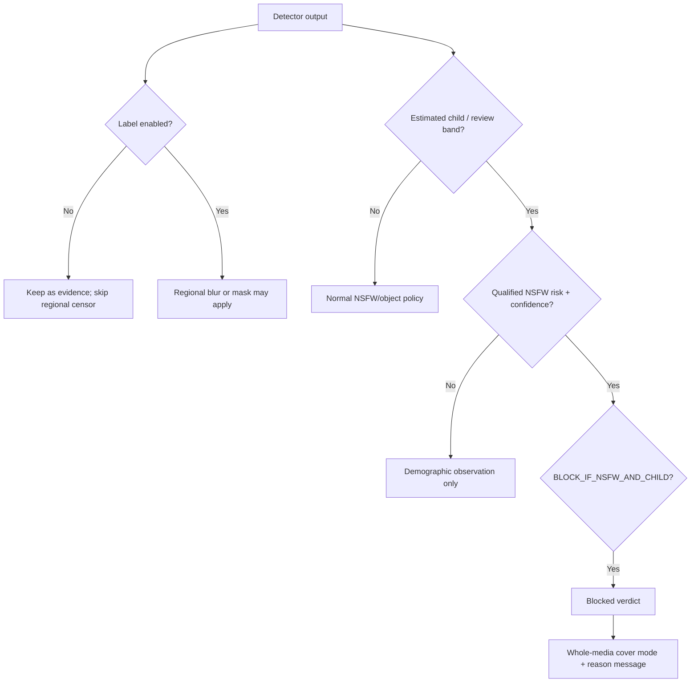

<a id="top"></a>

<div align="center">
  <a href="../README.md">
    
  </a>

  <h1>SafeVision Rule Library</h1>

  <p><strong>50 ready-to-run moderation and rendering policies.</strong></p>
  <p>Balanced defaults, solid covers, child-aware review, object filters, live streaming, CI gates, and specialized workflows.</p>

  <p>
    
    
    
    
  </p>

  <p>
    <a href="../README.md">Project home</a> ·
    <a href="#quick-choice">Quick choice</a> ·
    <a href="#rule-logic">Rule logic</a> ·
    <a href="#catalog">All 50 presets</a> ·
    <a href="../CHILD_PROTECTION.md">Protection policy</a>
  </p>
</div>

---

This folder contains 50 complete `BlurException.rule` presets. Start with
`01_balanced_default.rule`; move to a stricter preset only after testing it
against media representative of your own workload.

> [!IMPORTANT]
> A `.rule` file changes labels, policy gates, thresholds, cover style, and
> messages. It does **not** load a detector. Select models separately through
> `--detectors`, GUI controls, API `checks`, or `settings/configs.json`.

<a id="quick-choice"></a>

## 🎯 Quick choice

| If you need… | Start with | Why |
|---|---|---|
| General-purpose moderation | `01_balanced_default.rule` | Low-false-positive compound gate and familiar full blur |
| Public blocked artifact with no source pixels | `02_balanced_gray_cover.rule` | Balanced policy plus opaque gray cover |
| Maximum opaque simplicity | `03_balanced_black_cover.rule` | Fully black policy output with reason text |
| Family/social-photo tolerance | `33_family_photo_low_false_positive.rule` | Explicit-only censoring and balanced child gate |
| Manual review queue | `44_manual_review_queue.rule` | Neutral cover and review-band routing |
| CI compound rejection | `42_ci_compound_block.rule` | Designed for `--fail-on-policy` |
| Streaming | `40_live_stream_balanced.rule` | Real-time sensitivity and shorter review margin |
| Highest false-positive resistance | `46_low_false_positive.rule` | Critical-only, high-confidence compound evidence |
| Highest recall | `47_high_recall.rule` | Lower evidence gate; requires strong human review |
| Safety-object-only workflow | `28`, `29`, `30`, or `32` | Smoking/alcohol/drug object specializations |

Use a template with an image:

```powershell
python main.py -i .\input\photo.jpg -b --no-boxes -e .\rule_templates\01_balanced_default.rule
```

Use the same template with a video:

```powershell
python video.py -i .\input\clip.mp4 -e .\rule_templates\12_compound_child_gray.rule --detectors nude,age,gender -r 10/5 --with-audio
```

Use a template through the wrapper CLI:

```powershell
python safeVisionCLI.py process .\input\photo.jpg --blur -e .\rule_templates\03_balanced_black_cover.rule
```

`true` on a detection label means the region may be censored. The `BLOCK_*` keys decide when the age estimate changes the policy verdict. `FULL_COVER_MODE` controls only the whole-media result: `blur` obscures the source, while `gray`, `black`, and `color` replace every source pixel. A solid cover is the correct choice when the underlying media must never be visible.

The templates do not turn models on by themselves. Use the recommended
`--detectors` value, or set `processing.detectors` in
`settings/configs.json`. Age estimates are uncertain; never use them as proof
of legal age or identity.

<a id="rule-logic"></a>

## 🧠 How rule logic works



Rules separate three decisions that are easy to confuse:

1. **Detector selection** — which models run.
2. **Policy evaluation** — whether observations qualify for a block/review.
3. **Rendering** — boxes, regional censoring, or a whole-media cover.

### Risk tiers used by the balanced compound gate

| Tier | Typical NSFW groups | Balanced compound role |
|---|---|---|
| `LOW` | armpits, belly, feet, male chest context | Does not qualify |
| `MODERATE` | exposed buttocks | Does not qualify by default |
| `HIGH` | exposed female breast or anus | Qualifies at the confidence threshold |
| `CRITICAL` | exposed genitalia | Qualifies at the confidence threshold |

The exact score still matters. `PROTECTION_NSFW_MIN_RISK=HIGH` and
`PROTECTION_NSFW_MIN_CONFIDENCE=0.5` mean a lower-risk or lower-confidence box
cannot activate the balanced child + NSFW compound rule.

### Rule anatomy

```ini
# Regional censor switches
ARMPITS_EXPOSED = false
FEMALE_BREAST_EXPOSED = true
MALE_GENITALIA_EXPOSED = true

# Child-protection policy
BLOCK_IF_NSFW_AND_CHILD = true
BLOCK_IF_CHILD = false
BLOCK_ON_AGE_REVIEW = false
PROTECTION_NSFW_MIN_RISK = HIGH
PROTECTION_NSFW_MIN_CONFIDENCE = 0.5
UNDERAGE_AGE = 18
AGE_REVIEW_MARGIN = 3

# Whole-media rendering
FULL_COVER_MODE = gray
FULL_COVER_COLOR = 96,96,96
FULL_COVER_TEXT_COLOR = 255,255,255
FULL_COVER_SHOW_TEXT = true
FULL_COVER_MESSAGE_NSFW_AND_CHILD = Possible illegal content - review required
```

> [!CAUTION]
> The phrase “possible illegal content” is a configurable reviewer warning, not
> a finding of illegality. The model cannot establish verified age, consent,
> identity, intent, or jurisdiction.

<a id="catalog"></a>

## 📚 Complete template catalog

| # | File | Intended use | Recommended checks | What changes |
|---:|---|---|---|---|
| 1 | `01_balanced_default.rule` | Balanced default | `nude,age,gender` | Good first choice. Ignores exposed-armpit false positives and only combines HIGH+ NSFW evidence with estimated underage faces. |
| 2 | `02_balanced_gray_cover.rule` | Balanced with solid gray cover | `nude,age,gender` | Balanced detection with an opaque gray result whenever a full-cover rule fires. |
| 3 | `03_balanced_black_cover.rule` | Balanced with solid black cover | `nude,age,gender` | Balanced detection with a fully black result and centered reason text. |
| 4 | `04_balanced_custom_blue_cover.rule` | Balanced with custom blue cover | `nude,age,gender` | Example of a custom solid cover color for branded or kiosk output. |
| 5 | `05_balanced_no_cover_text.rule` | Balanced without cover text | `nude,age,gender` | Creates a clean full cover without writing policy text onto the media. |
| 6 | `06_strict_moderate.rule` | Strict moderate-risk policy | `nude,age,gender` | Lets MODERATE detections participate in the NSFW + underage compound rule. |
| 7 | `07_critical_only.rule` | Critical-only compound policy | `nude,age,gender` | Only genital detections can combine with an estimated underage face to block. |
| 8 | `08_high_confidence.rule` | High-confidence moderation | `nude,age,gender` | Reduces false positives by requiring 75% confidence for the compound policy. |
| 9 | `09_sensitive_confidence.rule` | Sensitive-confidence moderation | `nude,age,gender` | Raises recall by accepting HIGH+ compound evidence from 30% confidence. |
| 10 | `10_armpits_included.rule` | Strict regional armpit censoring | `nude,age,gender` | Opts exposed armpits back into regional censoring; useful only where that is intentional. |
| 11 | `11_compound_child_standard.rule` | NSFW plus estimated child | `nude,age,gender` | Blocks only when qualified NSFW evidence and an estimated underage face occur together. |
| 12 | `12_compound_child_gray.rule` | NSFW plus child, gray cover | `nude,age,gender` | Compound child-protection rule with a no-source-pixels gray cover. |
| 13 | `13_compound_child_black.rule` | NSFW plus child, black cover | `nude,age,gender` | Compound child-protection rule with a no-source-pixels black cover. |
| 14 | `14_block_any_estimated_child.rule` | Block any estimated child | `age,gender` | Blocks whenever an estimated underage face is found, even when NSFW is absent. |
| 15 | `15_block_any_child_black.rule` | Block any estimated child, black | `age,gender` | Underage-only blocking with an opaque black result. |
| 16 | `16_block_age_review_band.rule` | Block age review band | `nude,age,gender` | Blocks estimates inside the near-threshold review band as well as the normal compound rule. |
| 17 | `17_review_only_workflow.rule` | Review-band workflow | `age,gender` | Turns off compound blocking and blocks only estimates near the configured threshold. |
| 18 | `18_underage_threshold_16.rule` | Estimated age threshold 16 | `nude,age,gender` | Example jurisdiction/workflow threshold of estimated age below 16. |
| 19 | `19_underage_threshold_21.rule` | Estimated age threshold 21 | `age,gender` | Conservative adult-content access policy using an estimated age threshold of 21. |
| 20 | `20_wide_review_margin.rule` | Wide age review margin | `nude,age,gender` | Flags a five-year band above the underage threshold for human review. |
| 21 | `21_explicit_regions_only.rule` | Explicit regions only | `nude,age,gender` | Censors only HIGH and CRITICAL exposed regions; common body context stays visible. |
| 22 | `22_genitals_only.rule` | Genitals only | `nude` | Regional censoring is limited to exposed genital detections. |
| 23 | `23_breast_and_genitals.rule` | Breast and genitals | `nude` | Regional censoring for female breast and genital detections only. |
| 24 | `24_moderate_and_above.rule` | Moderate and above | `nude,age,gender` | Censors buttocks plus all HIGH and CRITICAL regions. |
| 25 | `25_no_common_body_context.rule` | No common body-context censor | `nude,age,gender` | Leaves feet, belly, male chest, and armpits alone while retaining explicit-region censoring. |
| 26 | `26_covered_labels_allowed.rule` | Covered labels allowed | `nude,age,gender` | Does not regional-censor covered clothing/body-context detections. |
| 27 | `27_all_safety_objects.rule` | All safety objects | `all` | Censors smoking, alcohol, and drug-object detections alongside nudity checks. |
| 28 | `28_smoking_objects_only.rule` | Smoking objects only | `objects` | Use with --detectors objects to censor smoking-related objects while leaving alcohol/drug labels excepted. |
| 29 | `29_alcohol_objects_only.rule` | Alcohol objects only | `objects` | Use with --detectors objects to censor bottles and drinking vessels. |
| 30 | `30_drug_objects_only.rule` | Drug objects only | `objects` | Use with --detectors objects to censor configured drug and syringe labels. |
| 31 | `31_nudity_no_objects.rule` | Nudity without object censoring | `nude,age,gender` | All optional safety-object labels are excepted; use nude/age/gender checks only. |
| 32 | `32_objects_without_nudity.rule` | Objects without nudity censoring | `objects` | Object-moderation preset; run with the objects detector to skip the NSFW model. |
| 33 | `33_family_photo_low_false_positive.rule` | Family-photo low false positive | `nude,age,gender` | Explicit-only regional censoring with the balanced HIGH compound child policy. |
| 34 | `34_workplace_filter.rule` | Workplace filter | `all` | Censors MODERATE+ nudity plus smoking/drug objects; ordinary low-risk body context is ignored. |
| 35 | `35_education_filter.rule` | Education filter | `all` | Conservative child-aware filter with opaque gray cover and age-review blocking. |
| 36 | `36_medical_human_review.rule` | Medical human-review workflow | `nude,age,gender` | Avoids low-risk escalation, keeps full blur reversible for authorized review, and widens the age review band. |
| 37 | `37_art_moderation.rule` | Art moderation | `nude,age,gender` | Uses CRITICAL-only compound escalation and explicit-region censoring to reduce overblocking in art collections. |
| 38 | `38_social_media_balanced.rule` | Social-media balanced | `nude,age,gender` | Balanced regional censoring plus an opaque gray policy block suitable for generated previews. |
| 39 | `39_dating_app_adult_gate.rule` | Adult-gate workflow | `age,gender` | Blocks any face estimated below 21 and covers the result in black. |
| 40 | `40_live_stream_balanced.rule` | Live-stream balanced | `nude,age,gender` | Moderate sensitivity and short review margin for live/video monitoring. |
| 41 | `41_video_archive_review.rule` | Video archive review | `nude,age,gender` | High-confidence compound blocking with visible blur for internal archive review. |
| 42 | `42_ci_compound_block.rule` | CI compound-block policy | `nude,age,gender` | Balanced policy intended with --fail-on-policy for automated pipelines. |
| 43 | `43_ci_any_underage.rule` | CI any-underage policy | `age` | Intended with --fail-on-underage or BLOCK_IF_CHILD for strict upload gates. |
| 44 | `44_manual_review_queue.rule` | Manual review queue | `nude,age,gender` | Blocks the age review band and uses a neutral gray result with clear reviewer text. |
| 45 | `45_zero_tolerance.rule` | Zero-tolerance policy | `all` | Blocks any estimated child/review result and accepts LOW-risk NSFW compound evidence. |
| 46 | `46_low_false_positive.rule` | Maximum false-positive resistance | `nude,age,gender` | Critical-only, high-confidence compound policy with common context and covered labels excepted. |
| 47 | `47_high_recall.rule` | High-recall moderation | `all` | Sensitive MODERATE+ compound gate with lower confidence; requires a review process. |
| 48 | `48_solid_gray_no_text.rule` | Silent solid gray cover | `nude,age,gender` | A no-source-pixels gray cover with no text overlay. |
| 49 | `49_black_legal_review.rule` | Black legal-review cover | `nude,age,gender` | Opaque black output with cautious review wording for compound child-protection matches. |
| 50 | `50_custom_brand_cover.rule` | Custom branded cover | `nude,age,gender` | Example custom-color cover and neutral moderation message; change the BGR values to match your product. |

## ✍️ Editing a preset

Copy a preset to a new filename before changing it. Keep one `KEY = value` per line. Messages do not need quotes. Colors in `.rule` files use OpenCV BGR order (`blue,green,red`); the web API and `vision2` also accept web-style `#RRGGBB` request colors.

Regenerate the shipped presets after editing this generator:

```powershell
python .\rule_templates\generate_templates.py
```

The generator is the source of truth for shipped preset consistency. A manual
change to one generated file can be overwritten the next time it runs.

### Value reference

| Key family | Accepted form | Notes |
|---|---|---|
| Detection label | `true` / `false` | Enables regional censor eligibility, not model loading |
| `BLOCK_*` | `true` / `false` | Controls compound, child-only, and review-band policy |
| `UNDERAGE_AGE` | number | Estimated threshold, not verified legal age |
| `AGE_REVIEW_MARGIN` | number | Years above threshold routed to review |
| `PROTECTION_NSFW_MIN_RISK` | `LOW`, `MODERATE`, `HIGH`, `CRITICAL` | Minimum compound evidence tier |
| `PROTECTION_NSFW_MIN_CONFIDENCE` | `0.0`–`1.0` | Minimum compound score |
| `FULL_COVER_MODE` | `blur`, `gray`, `black`, `color` | Whole-media appearance |
| Color keys | `B,G,R` | `.rule` files use OpenCV order |
| Message keys | plain text | Do not wrap in quotes |

## 🧪 Validate a customized rule

Copy first, then test:

```powershell
Copy-Item `
  ".\rule_templates\01_balanced_default.rule" `
  ".\rule_templates\local_product_policy.rule"

python main.py `
  -i ".\input\safe_fixture.jpg" `
  -b --no-boxes --no-save-boxes-copy `
  --detectors nude,age,gender `
  -e ".\rule_templates\local_product_policy.rule"
```

Review the analysis JSON, not only the rendered pixels. Confirm:

- selected detectors;
- enabled/disabled label decision;
- estimated child/review observations;
- qualified NSFW evidence;
- policy reason and thresholds;
- full-cover mode/message;
- final boxes and copy settings.

For CI:

```powershell
python main.py `
  -i ".\input\fixture.jpg" `
  -e ".\rule_templates\42_ci_compound_block.rule" `
  --fail-on-policy

$exitCode = $LASTEXITCODE
if ($exitCode -eq 2) { "Blocked by configured policy" }
```

## 🚫 Common mistakes

- Selecting an object preset without `--detectors objects` or `all`.
- Assuming `BLOCK_IF_CHILD=false` disables age analysis; it only changes policy.
- Turning `ARMPITS_EXPOSED=true` back on without testing family-photo false
  positives.
- Using full blur where no original structure may remain.
- Publishing the `Prosses/` reviewer copy.
- Treating repeated video face observations as unique people.
- Changing thresholds without recording the rule version.
- Using age/gender outputs as identity or verified legal-age evidence.

## 🌐 API and GUI mapping

| Rule concept | CLI | GUI | Web API |
|---|---|---|---|
| Select rule | `-e file.rule` | Advanced rule-file field | `SAFEVISION_RULE_FILE` |
| Select checks | `--detectors` | Detector Models | `checks` / `SAFEVISION_DETECTORS` |
| Compound block | Boolean flag override | Protection Policy toggle | `block_if_nsfw_and_child` |
| Thresholds | age/risk/confidence flags | Numeric/select controls | Request fields or `.env` |
| Cover mode/color/text | full-cover flags | Output Privacy and Full Cover | Render fields or `.env` |

## 🔒 Rule governance

For a production policy, store the reviewed file with:

- owner and approval date;
- product/use-case scope;
- expected detectors and model hashes;
- validation dataset/version;
- false-positive/false-negative review;
- change history;
- rollback preset;
- human-review and retention procedure.

---

<div align="center">

### Pick a policy, test it, and keep the reason auditable.

[](../README.md)
[](../CHILD_PROTECTION.md)
[](../settings/README.md)

<br>

<a href="#top">⬆️ Back to top</a>

</div>
