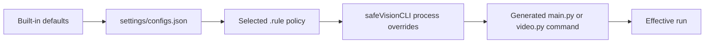

<a id="top"></a>

<div align="center">
  <a href="../README.md">
    
  </a>

  <h1>SafeVision Settings</h1>

  <p><strong>Persistent defaults for the command console and Screen Guard.</strong></p>

  <p>
    
    
    
  </p>

  <p>
    <a href="../README.md">Project home</a> ·
    <a href="../rule_templates/README.md">Rule presets</a> ·
    <a href="../apps/live/README.md">Live tools</a> ·
    <a href="../SafeVision%20Web%20API/README.md">Web API</a>
  </p>
</div>

---

## 🎯 What this folder controls

`configs.json` is the persistent configuration owned by `safeVisionCLI.py`.
It stores:

- project runtime paths;
- image/video processing defaults;
- active rule profile and editable rule profiles;
- Screen Guard capture, overlay, smoothing, and privacy defaults.

It does **not** automatically replace every direct script's command-line
defaults, and it is not the Web API `.env` file.

| Surface | Persistent source | Per-run override |
|---|---|---|
| `safeVisionCLI.py process` | `settings/configs.json` | Wrapper command options |
| `safeVisionCLI.py screen` | `settings/configs.json` | Extra Screen Guard arguments |
| `main.py` / `video.py` directly | Built-in defaults + selected `.rule` | Direct command-line flags |
| Desktop GUI | `safevision_settings.json` at project root | GUI controls |
| Local Web API | `SafeVision Web API/.env` | HTTP request fields |
| `vision2` service | Its admin/database configuration | API/admin request controls |

## 🚀 Safe configuration commands

Initialize any missing folders/settings:

```powershell
python safeVisionCLI.py init
```

Show the complete configuration:

```powershell
python safeVisionCLI.py settings show
```

Read one value:

```powershell
python safeVisionCLI.py settings get processing.detectors
```

Update values without manually editing JSON:

```powershell
python safeVisionCLI.py settings set processing.detectors "nude,age,gender"
python safeVisionCLI.py settings set processing.save_boxes_copy false
python safeVisionCLI.py settings set processing.full_cover_mode gray
python safeVisionCLI.py settings set screen_guard.mode blur
python safeVisionCLI.py settings set screen_guard.show_boxes false
```

> [!TIP]
> Prefer the settings command for one-value changes. It preserves JSON types
> such as booleans and numbers and avoids accidental trailing commas.

## 🗂️ Top-level schema

```json
{
  "version": 1,
  "created_at": "...",
  "active_rule_profile": "default",
  "paths": {},
  "processing": {},
  "screen_guard": {},
  "rule_profiles": {}
}
```

### `paths`

| Key | Default | Purpose |
|---|---|---|
| `input` | `input` | Optional local source-media folder |
| `output` | `output` | Requested final image output |
| `video_output` | `video_output` | Generated video/reports/markers |
| `blur` | `Blur` | Clean regional-censor image copy |
| `process` | `Prosses` | Unredacted reviewer boxes copy |
| `logs` | `Logs` | Text logs and analysis JSON |
| `models` | `Models` | ONNX and model metadata files |

Relative paths resolve from the SafeVision repository root.

### `processing`

<details open>
<summary><strong>Detector and model settings</strong></summary>

| Key | Typical value | Meaning |
|---|---|---|
| `providers` | empty | Automatic ONNX provider selection |
| `detectors` | `nude,age,gender` | Checks selected by the wrapper |
| `rule_file` | `BlurException.rule` | Active rule file |
| `nsfw_model` | `Models/best.onnx` | NSFW/body model |
| `object_model` | `Models/safety_objects.onnx` | Optional object model |
| `object_labels` | labels JSON path | Object class/preprocessing data |
| `object_threshold` | `0.25` | Minimum object score |
| `age_gender_model` | age/gender ONNX path | Shared demographic model |
| `underage_age` | `18.0` | Estimated child boundary |
| `age_review_margin` | `3.0` | Human-review band above boundary |
| `min_face_size` | `32` | Fallback face minimum in pixels |
| `face_padding` | `0.18` | Crop padding fraction |

</details>

<details>
<summary><strong>Regional rendering and output privacy</strong></summary>

| Key | Safe common value | Meaning |
|---|---|---|
| `mask_shape` | `rectangle` | Regional mask geometry |
| `mask_color` | `0,0,0` | OpenCV BGR solid-mask color |
| `blur_strength` | `23` or higher | Regional Gaussian kernel |
| `blur_sigma` | `0.0` | Automatic sigma when zero |
| `enhanced_blur` | `false` | Stronger video blur path |
| `boxes` | `false` for public output | Detection boxes on final output |
| `save_boxes_copy` | `false` | Unredacted reviewer artifact |
| `save_blur_copy` | `true` | Separate clean censor copy |

</details>

<details>
<summary><strong>Whole-media cover</strong></summary>

| Key | Values | Meaning |
|---|---|---|
| `full_cover_mode` | `blur`, `gray`, `black`, `color` | Whole-media appearance |
| `full_cover_color` | BGR or hex-compatible value | Custom solid cover |
| `full_cover_text_color` | color | Centered reason text |
| `full_cover_text` | boolean | Show/hide reason text |
| `full_cover_message` | text or empty | Per-wrapper override |
| `force_full_cover` | boolean | Cover without an automatic trigger |

Solid gray, black, and color modes replace source pixels. Blur retains derived
visual structure.

</details>

<details>
<summary><strong>Video and reports</strong></summary>

| Key | Meaning |
|---|---|
| `codec` | OpenCV video codec |
| `with_audio` | Ask FFmpeg to preserve audio |
| `delete_frames` | Remove temporary rendered frames |
| `rule` | Monitoring percentage/count trigger |
| `full_blur_rule` | Legacy-named full-cover label/frame trigger |
| `save_report` | Write JSON/CSV reports |
| `report_formats` | `json,csv` selection |
| `export_markers` | `edl`, `fcpxml`, or both |
| `marker_gap` | Merge observations into timeline ranges |

</details>

### `screen_guard`

The Screen Guard profile is grouped by responsibility:

| Group | Keys |
|---|---|
| Source | `monitor`, `capture_backend`, `fps`, `overlay_fps` |
| Detection | `threshold`, `providers`, `rules`, `label_filter`, `respect_rules` |
| Tracking | `smooth_overlay`, IoU/alpha, hold, merge distance/overlap |
| Feedback safety | feedback delta, safe capture, overlay-capture exclusion |
| Rendering | boxes, labels, blur/block, colors, line width, padding |
| Privacy | `privacy_on_detection`, whole-screen mode behavior |
| Interaction | status HUD and click-through |

Read the [Live tools guide](../apps/live/README.md#screen-guard) before tuning
feedback, smoothing, or capture settings.

### `rule_profiles`

Profiles are complete dictionaries of label switches and policy values. The
active profile can be copied to `BlurException.rule` through the CLI:

```powershell
python safeVisionCLI.py rules list
python safeVisionCLI.py rules use default
python safeVisionCLI.py rules show default
```

The `rule_templates/` folder contains richer workflow presets. Profiles and
templates should use the same key names but serve different purposes:

- `rule_profiles` are convenient persistent CLI profiles;
- `rule_templates/*.rule` are portable, reviewable policy files;
- `BlurException.rule` is the active root rule used by default.

## 🧭 Configuration precedence



For the Web API, replace this chain with `.env` followed by request parameters.
For direct `main.py`/`video.py` calls, the settings file is bypassed.

## 🔒 Production guidance

- Version-control reviewed `.rule` files, not local sensitive media.
- Keep reviewer copies disabled by default.
- Use separate settings for development and production deployments.
- Record the effective detectors, providers, model hashes, rule file, and
  thresholds with release evidence.
- Do not put API secrets in this JSON; use the service `.env` or a secret store.
- A threshold change is a behavior change and should receive tests/review.

## 🧯 Recovery

If the JSON becomes invalid, move the broken file to a backup location and run:

```powershell
python safeVisionCLI.py init
python safeVisionCLI.py status
```

Do not delete a production configuration until its paths, profiles, and custom
thresholds are backed up.

<p align="right"><a href="#top">⬆️ Back to top</a></p>
